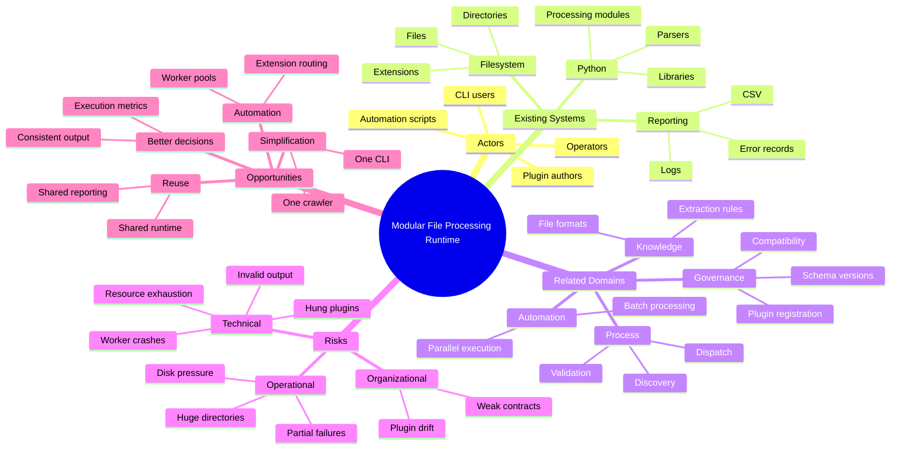
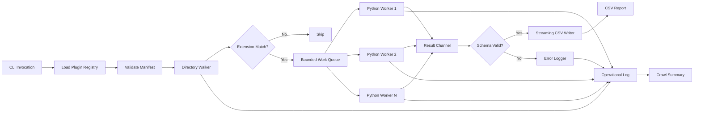
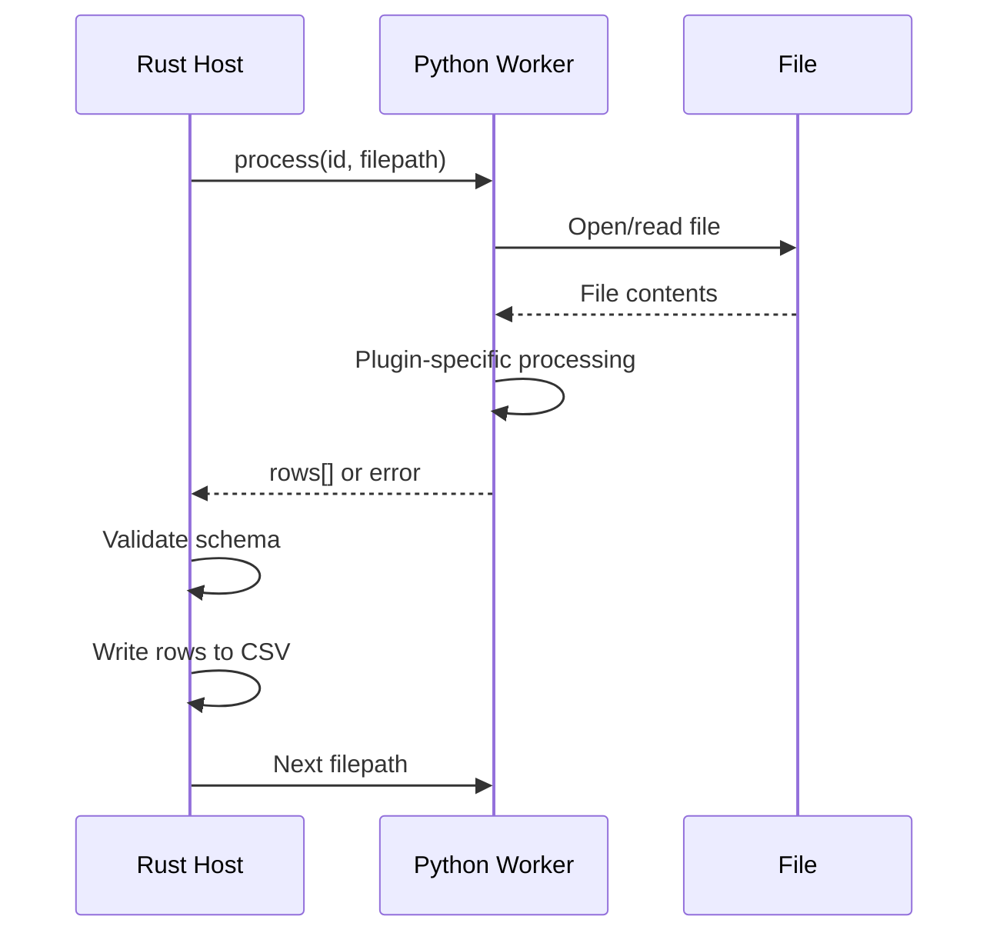

# Modular High-Throughput File Processing Crawler

## 1. Problem

The recurring problem is not the individual file-processing logic; it is the repeated need to rebuild the same surrounding infrastructure: recursively crawl directories, select files, dispatch processing, run work concurrently, handle failures, collect structured results, log execution, and write a coherent report.

The desired system is a command-line tool, tentatively called `crawl`, with a stable high-performance core and independently installable Python processing modules. Each module accepts a file path and returns structured data defined by a declarative schema. The crawler owns traversal, concurrency, process management, validation, aggregation, logging, and CSV generation.

The analysis treats this as a system-of-interest problem rather than an isolated scripting problem, consistent with the supplied problem-to-solution method. 

### Working Assumptions

* File processing modules will often depend on Python libraries that should not need to be reimplemented in Rust.
* A directory may contain hundreds of thousands or millions of files, so bounded concurrency and streaming are more important than loading the entire crawl into memory.
* Plugins may fail, hang, crash, emit malformed output, or encounter files they cannot parse; one failure should not stop the crawl.
* A plugin's output schema should be known before execution so the crawler can validate results and create a deterministic CSV.
* One input file may produce zero, one, or many report rows.
* The first implementation should optimize for local execution rather than distributed processing.
* Plugin processes should be isolated from the Rust crawler so a Python crash or dependency problem does not crash the crawl engine.

### Five Whys Analysis

1. **Why?** File-processing utilities repeatedly need directory traversal, extension filtering, concurrency, logging, and CSV output.
2. **Why?** Those operational concerns are currently coupled to each individual file-analysis script.
3. **Why?** There is no stable execution contract separating generic crawl infrastructure from domain-specific file-processing logic.
4. **Why?** Processing functions have no standardized manifest, schema, lifecycle, registration mechanism, or result protocol.
5. **Why?** The reusable component has been treated as a script pattern rather than as a plugin-hosting execution platform.

### Condensed Problem Analysis

The reusable asset is not another file crawler. It is a **file-processing runtime**. Directory traversal happens to be its primary input mechanism, but the important abstraction is a host that maps files to isolated processing functions and maps their structured outputs into a common report.

Rust and Python are a strong combination for this architecture. Rust can efficiently perform filesystem traversal, scheduling, bounded parallelism, subprocess management, streaming, and CSV writing. Python can remain the plugin language, preserving the large ecosystem of file parsers and analysis libraries.

Rust supports multithreaded processing. More importantly for this design, it can combine multithreading with multiple Python subprocesses. That avoids Python's Global Interpreter Lock becoming the central concurrency constraint because separate Python processes have separate interpreters.

The important architectural decision is not simply "one process per file." Starting a Python interpreter for every file could dominate execution time for small files. The runtime should support process isolation while normally maintaining a bounded pool of reusable Python workers for the selected module.

### Problem Statement

The system of interest is a reusable local file-processing platform consisting of a crawler, plugin registry, Python execution environment, schema contract, reporting system, and operational controls. Developers currently duplicate infrastructure whenever they need to analyze a directory, creating inconsistent behavior, weak failure handling, and unnecessary implementation work. A common Rust host with versioned Python plugin contracts would separate stable crawl mechanics from changing file-analysis logic; without that separation, every new processor will continue to reinvent traversal, concurrency, reporting, logging, and validation.

## 2. Context



### Context Analysis

There are two distinct responsibilities in the proposed system. The **host** answers "which files should be processed, when, and how safely?" The **plugin** answers "what information should be extracted from this file?" Keeping that boundary strict is what makes the system reusable.

A plugin therefore needs more than Python code. It needs a machine-readable contract describing its name, version, supported file extensions, executable entry point, output schema, and possibly operational limits. This manifest allows the Rust host to reason about the plugin without understanding its implementation.

The output contract deserves particular attention. CSV has a fixed tabular shape, while a Python module may naturally produce complex objects. The initial contract should therefore restrict plugin output to zero or more records matching a flat declared schema. Nested objects and arbitrary arrays should either be prohibited initially or serialized explicitly as JSON-valued columns.

Process isolation is useful for reliability and dependency management. A plugin can use libraries such as `pypdf`, `openpyxl`, image processors, or custom parsers without linking them into the Rust executable. The host can terminate a hung worker, detect a crash, capture `stderr`, and continue processing other files.

Concurrency must be bounded. "Use every possible thread" is usually wrong for a large directory because the bottleneck may be disk I/O, network storage, Python CPU work, memory, or file descriptor limits. The crawler should expose a worker-count option while providing a reasonable default based on CPU count and plugin configuration.

Plugin governance also matters. Registration should mean more than copying a `.py` file somewhere. Installation should validate the manifest, Python entry point, schema, protocol compatibility, and ideally a small test invocation. That changes plugin failures from late runtime surprises into early registration errors.

## 3. Solution

### Proposed Solution

Build `crawl` as a Rust command-line application that acts as a **plugin host and high-throughput filesystem scheduler**.

The Rust core would:

* load a registered plugin manifest;
* validate its configuration;
* recursively traverse an input directory;
* select files using configured extensions;
* place matching paths onto a bounded work queue;
* maintain a pool of isolated Python plugin workers;
* send file paths to available workers;
* receive structured records;
* validate each record against the declared schema;
* stream valid records into one CSV;
* record file-level and plugin-level failures in structured logs; and
* produce a final crawl summary.

The Python side would expose a deliberately small contract:

```text
input:  filepath
output: array[record]
```

Each returned record must conform to the schema declared in the plugin manifest.

A plugin manifest could look like this:

```yaml
api_version: "1"
name: entity-lines
version: "1.0.0"

runtime:
  language: python
  entrypoint: entity_lines.processor
  function: process

files:
  extensions:
    - ".txt"
    - ".md"

schema:
  - name: filename
    type: string
    nullable: false

  - name: line
    type: integer
    nullable: false

  - name: entity
    type: string
    nullable: false

execution:
  timeout_seconds: 30
  workers: auto
```

The Python implementation could remain extremely small:

```python
def process(filepath: str) -> list[dict]:
    records = []

    with open(filepath, "r", encoding="utf-8") as file:
        for line_number, text in enumerate(file, start=1):
            for entity in extract_entities(text):
                records.append(
                    {
                        "filename": filepath,
                        "line": line_number,
                        "entity": entity,
                    }
                )

    return records
```

The preferred interprocess protocol is newline-delimited JSON rather than parsing arbitrary Python stdout. For example:

```json
{"id":42,"filepath":"/data/a.txt"}
```

and:

```json
{"id":42,"status":"ok","rows":[{"filename":"/data/a.txt","line":7,"entity":"Example"}]}
```

This creates a language-neutral boundary. Python is the first plugin runtime, but another implementation could later be written in Rust, Go, JavaScript, or another language without changing the crawler.

The CLI could be:

```bash
crawl run entity-lines \
  --input /data/documents \
  --output report.csv \
  --log crawl.log
```

Supporting management commands would make plugins first-class:

```bash
crawl plugin install ./entity-lines
crawl plugin validate entity-lines
crawl plugin list
crawl plugin inspect entity-lines
crawl plugin remove entity-lines
```

### Solution Principles

* **Separate orchestration from processing.** Rust owns crawling and execution; plugins own file-specific analysis.
* **Make the boundary explicit.** Plugins communicate through a small, versioned request/response protocol and declared schema.
* **Stream everything possible.** Do not accumulate the directory listing or final report in memory.
* **Isolate failures.** A malformed file or crashed plugin worker should affect that task, not the entire crawl.
* **Validate early and continuously.** Validate manifests at installation and returned records during execution.
* **Bound concurrency.** Worker counts, queues, timeouts, and resource usage must remain controlled.

### Expected Benefits

* New file processors contain primarily domain-specific extraction logic rather than duplicated crawling infrastructure.
* Rust can traverse large directory trees and coordinate parallel processing efficiently.
* Python plugin authors retain access to the existing Python file-processing ecosystem.
* A declared schema makes every generated CSV deterministic and machine-readable.
* Standardized logging, timeouts, error handling, and metrics apply automatically to every plugin.
* Plugins can be independently installed, upgraded, validated, and versioned.

### Tradeoffs

* A Rust/Python hybrid is more operationally complex than a pure Python script.
* Process boundaries require serialization and introduce IPC overhead.
* A worker pool is faster than spawning one process per file but requires a small request/response protocol.
* Restricting report schemas to flat records makes CSV reliable but limits arbitrary nested output.
* Supporting arbitrary third-party Python plugins creates a security boundary; subprocess isolation is useful but is not a complete sandbox.
* Supporting many plugin runtimes too early would increase complexity without improving the initial use case.

## 4. Implementation

### Implementation Overview

The implementation should use a producer/consumer architecture. A filesystem walker produces matching file paths. A bounded scheduler feeds those paths to a fixed number of Python workers. Workers execute the plugin and return structured records. The Rust host validates those records and sends them to a single report writer.

This design allows file discovery, Python processing, and CSV output to proceed concurrently without retaining the entire crawl in memory.

### Suggested Architecture or Workflow



A worker interaction can remain simple:



### Implementation Steps

1. **Define the plugin contract.** Create a versioned YAML manifest, supported field types, request/response JSON protocol, error format, and rules for zero/one/many output records.

2. **Build plugin registration and validation.** Implement `plugin install`, `plugin validate`, `plugin list`, and `plugin inspect`. Validation should check the manifest schema, Python environment, importable entry point, declared callable, protocol version, and optional self-test.

3. **Build the Rust crawl engine.** Implement recursive walking, extension filtering, symlink policy, ignored paths, bounded queues, cancellation, and crawl statistics. Libraries such as `walkdir` or `ignore` can provide proven directory traversal rather than implementing it manually.

4. **Implement the Python worker protocol.** Start a bounded pool of Python subprocesses and communicate through JSON Lines over `stdin` and `stdout`. Capture `stderr` separately for diagnostic logging. Restart crashed workers and apply per-file timeouts.

5. **Add schema validation and streaming reporting.** Validate each returned record against the module schema, normalize field ordering, and immediately write validated rows through Rust's CSV writer rather than holding all results in memory.

6. **Add operational controls.** Support worker count, queue size, timeout, fail-fast mode, maximum errors, verbosity, overwrite protection, and graceful cancellation.

7. **Add observability.** Log crawl start/end, plugin version, files discovered, files matched, files completed, records emitted, errors, timeouts, worker restarts, and execution duration.

8. **Benchmark realistic workloads.** Test SSD, spinning disk, and network-mounted directories with both CPU-heavy and I/O-heavy plugins. Use the results to select default concurrency instead of assuming more workers always improve throughput.

### Technical Notes

* **Rust concurrency:** Rust supports native OS threads and async execution. For this application, a small number of Rust coordination threads plus multiple Python subprocess workers is a practical model.
* **Recommended Rust stack:** `clap` for CLI parsing, `serde`/`serde_yaml`/`serde_json` for configuration and protocol messages, `csv` for reporting, `tracing` for structured logs, and `walkdir` or `ignore` for traversal.
* **Process model:** Avoid launching Python separately for every file unless startup cost is irrelevant. Start `N` workers once and send many file requests through each worker.
* **Backpressure:** Use bounded channels. If Python workers cannot keep up, directory discovery should eventually block rather than consume unlimited memory.
* **CSV ownership:** Only the Rust process should write the final CSV. Multiple Python processes should never write directly to it.
* **Ordering:** Default output should probably be completion-order for maximum throughput. Add an optional deterministic-order mode if reproducible row ordering is required.
* **Schema types:** Begin with `string`, `integer`, `number`, `boolean`, and optionally `datetime`. Treat more complex values as serialized strings until there is a demonstrated need for richer output formats.
* **File metadata:** Consider reserved host-generated columns such as `_path`, `_module`, `_status`, or `_error`, rather than requiring every plugin to generate common crawl metadata.
* **Logs:** Prefer structured JSON logs internally, even if a human-readable mode is also available.
* **Exit codes:** Distinguish configuration failure, plugin failure, crawl failure, and successful completion with partial file errors.
* **Security:** A Python plugin must initially be treated as trusted executable code. A subprocess provides crash isolation, not a security sandbox.
* **Packaging:** A plugin could eventually be a directory containing `plugin.yaml`, Python source or a Python package, and optional dependency metadata.

A stronger manifest might eventually become:

```yaml
api_version: "1"

plugin:
  name: entity-lines
  version: "1.0.0"
  description: Extract entities and source line numbers

runtime:
  type: python
  command:
    - python
    - -m
    - entity_lines.worker

input:
  extensions:
    - ".txt"
    - ".md"
  follow_symlinks: false

output:
  format: records
  schema:
    filename:
      type: string
      required: true
    line:
      type: integer
      required: true
    entity:
      type: string
      required: true

execution:
  workers: auto
  timeout_seconds: 30
  max_retries: 1
```

The corresponding conceptual boundary is:

```text
                   STABLE CORE
┌────────────────────────────────────────────┐
│ crawl                                      │
│                                            │
│ filesystem → scheduling → validation       │
│        → process management → CSV/logging  │
└──────────────────┬─────────────────────────┘
                   │
             versioned protocol
                   │
       ┌───────────┼───────────┐
       ▼           ▼           ▼
   Python       Python      Python
   Plugin A     Plugin B    Plugin C

   filepath     filepath    filepath
      ↓            ↓           ↓
   records[]    records[]   records[]
```

### Risks and Mitigations

| Risk                                         | Impact | Mitigation                                                                                                 |
| -------------------------------------------- | ------ | ---------------------------------------------------------------------------------------------------------- |
| Python startup overhead dominates processing | High   | Maintain reusable subprocess workers instead of spawning once per file                                     |
| Plugin hangs indefinitely                    | High   | Enforce per-file timeout and terminate/restart the affected worker                                         |
| Plugin crashes                               | Medium | Detect process exit, log the affected file, restart worker, continue crawl                                 |
| Plugin emits malformed JSON                  | Medium | Treat stdout as protocol-only, validate every message, reserve stderr for diagnostics                      |
| Returned data violates schema                | High   | Validate records before writing and record schema failures separately                                      |
| Huge directory exhausts memory               | High   | Stream traversal through bounded queues rather than collecting paths first                                 |
| Too many workers overwhelm disk or memory    | High   | Bound worker count and make concurrency configurable                                                       |
| Concurrent writers corrupt output            | High   | Use one Rust-owned CSV writer receiving records through a channel                                          |
| CSV cannot represent nested plugin output    | Medium | Require flat schemas initially; permit explicit JSON-string fields later                                   |
| Files change during crawl                    | Medium | Define best-effort filesystem semantics and optionally record metadata such as size and modification time  |
| Plugin dependencies conflict                 | Medium | Support a plugin-specific virtual environment or explicit Python interpreter                               |
| Third-party plugin executes malicious code   | High   | Treat plugins as trusted initially; add OS-level sandboxing only if untrusted plugins become a requirement |
| Plugin manifest changes incompatibly         | Medium | Version the host/plugin API and reject unsupported versions                                                |
| Errors disappear in very large crawls        | Medium | Generate both structured logs and an end-of-run summary with counts by error type                          |

## 5. Discussion

### Interpretation

The useful abstraction is broader than a "fast directory crawler." It is a **map-style processing runtime for files**:

```text
File → Plugin → Records
```

The crawler is responsible for efficiently applying that function to a large filesystem:

```text
Directory
    ↓
Files
    ↓
Filter
    ↓
Parallel map(plugin)
    ↓
Validate
    ↓
Flatten records
    ↓
CSV
```

That separation creates leverage. Future modules need only implement file-specific logic. A PDF metadata extractor, source-code scanner, image classifier, document entity extractor, checksum generator, spreadsheet analyzer, or archive inspector could all run on the same infrastructure.

Rust is well suited to the host because the host's difficult work is orchestration: filesystem traversal, concurrency, queues, process supervision, memory safety, streaming I/O, and reliable command-line behavior. Python is well suited to the modules because the difficult work there is integration with specialized parsing and analysis libraries.

The strongest architectural improvement over the initial concept is the distinction between **process isolation** and **process-per-file execution**. The former is valuable; the latter can be unnecessarily expensive. A persistent pool preserves isolation while amortizing Python interpreter startup across many files.

The result contract is equally important. The plugin should not merely "print something that eventually becomes CSV." It should emit typed records through a protocol. CSV is then one renderer owned by the host. This leaves room for later output formats such as JSONL, SQLite, or Parquet without changing individual plugins.

### Challenge the Frame

| Challenge Question                                                                               | Why It Matters                                                                                                                                                                             |
| ------------------------------------------------------------------------------------------------ | ------------------------------------------------------------------------------------------------------------------------------------------------------------------------------------------ |
| What assumption would most change the solution if false?                                         | If plugins are extremely lightweight and process only a few files, a Rust host and subprocess protocol may be unnecessary complexity compared with a Python framework.                     |
| What has the analysis made seem inevitable?                                                      | Rust has been positioned as the host, but the core architectural value comes from the plugin contract and runtime separation, not specifically from Rust.                                  |
| What alternative problem definition might produce a different solution?                          | If the real problem is reusable file transformations rather than maximum crawl throughput, a Python package with standardized plugins could solve most of the problem more cheaply.        |
| What constraint is binding: money, time, labor, risk, knowledge, authority, tools, or attention? | The likely binding constraints are developer repetition and reliable throughput; benchmarks should determine whether raw crawler performance is actually limiting.                         |
| What would make the solution fail in practice?                                                   | A weak plugin contract, expensive process startup, uncontrolled resource use, dependency conflicts, or schemas unable to represent real module outputs would undermine reuse.              |
| What is the smallest useful version of success?                                                  | One Rust executable, one YAML plugin format, one persistent Python worker protocol, extension filtering, bounded parallelism, schema validation, CSV output, and structured error logging. |

The solution still appears strong, but its success depends more on getting the plugin contract and worker lifecycle right than on optimizing directory traversal. The first version should therefore prove the complete host-to-plugin-to-CSV path before introducing advanced plugin management or multiple output formats.

### Alternatives Considered

| Alternative                              | Strength                                                                     | Weakness                                                                                                            |
| ---------------------------------------- | ---------------------------------------------------------------------------- | ------------------------------------------------------------------------------------------------------------------- |
| Pure Python framework                    | Fastest implementation; simplest plugin integration; rich ecosystem          | Less isolation by default and potentially weaker control over very high-throughput orchestration                    |
| Rust host with Python subprocess plugins | Strong performance, isolation, concurrency, and clear architectural boundary | More engineering effort and an IPC protocol must be maintained                                                      |
| Rust with embedded Python through PyO3   | Lower invocation overhead and tight Rust/Python integration                  | Python failures and interpreter lifecycle become more coupled to the host; concurrency behavior is more complicated |
| One Python process per file              | Excellent isolation and very simple lifecycle                                | Interpreter startup can severely reduce throughput                                                                  |
| Persistent Python worker pool            | Good isolation with much lower startup overhead                              | Requires framing requests, tracking IDs, timeouts, and worker restarts                                              |
| Generic workflow engine                  | Already provides scheduling, retries, and orchestration                      | Usually much heavier than necessary for a local filesystem-focused tool                                             |

### Open Questions

* Should one invocation run exactly one plugin, or should a single crawl eventually run several compatible plugins against each file?
* Should the module return only report fields, or should the host automatically inject fields such as source path, processing duration, and error status?
* Are duplicate rows valid, or should the runtime provide optional deduplication?
* Does output ordering need to be deterministic?
* Should plugin dependencies live in their own virtual environments?
* Should plugins be trusted local code, or is sandboxing untrusted plugins an eventual requirement?
* Should extension routing remain inside each plugin manifest, or should one project-level YAML configuration be able to override it?
* Is CSV always the final deliverable, or should the internal architecture deliberately support JSONL, SQLite, and Parquet later?
* Should a plugin process one file at a time, or should the protocol eventually support batches of paths for processors that benefit from batching?
* Should resumable crawls and checkpoints be part of the first release or a later operational feature?

### Recommended Next Step

Define and implement the smallest end-to-end contract before optimizing the crawler: create a versioned `plugin.yaml`, a JSONL request/response protocol, one trivial Python reference plugin, and a Rust prototype that discovers matching files, runs a bounded pool of persistent Python workers, validates their records, and streams them into CSV. Benchmark that vertical slice on a realistically large directory; its results will determine worker-pool defaults and reveal whether the next engineering effort belongs in filesystem traversal, Python execution, schema handling, or reporting.
