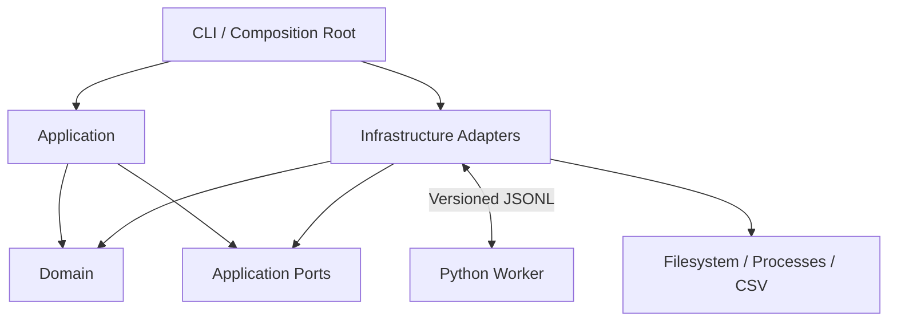
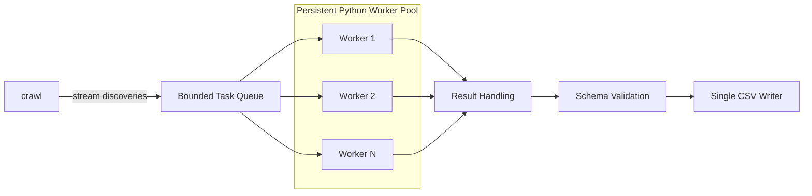
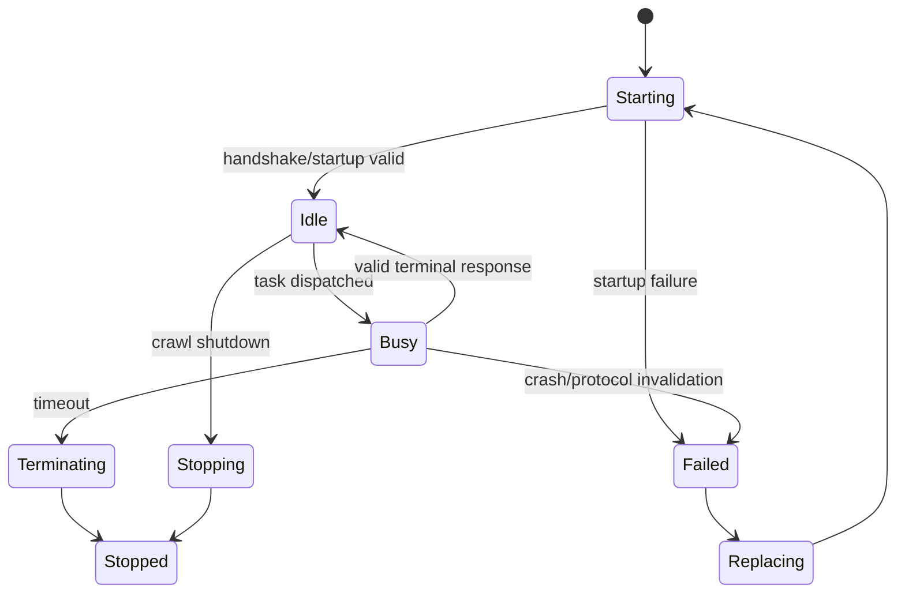

The SRS is unusually complete on the **Rust host**, but the implementation-planning requirement to “use Python with a virtual environment and `pyproject.toml`” needs to be interpreted carefully: Python should implement the **plugin SDK/reference worker and plugin test harness**, not replace the explicitly required Rust host (REQ-002). The host remains Rust.

## 1. Implementation Strategy

Implement `crawl` as a Rust workspace with a strict layered/hexagonal architecture around the crawl engine, plus a separately packaged Python SDK/reference worker managed through `venv` and `pyproject.toml`.

The first milestone should be a **vertical contract slice**:

```text
plugin.yaml
    ↓
Rust manifest parser/validator
    ↓
recursive streaming discovery
    ↓
bounded scheduler
    ↓
persistent Python worker
    ↓ JSONL
protocol validation
    ↓
schema validation
    ↓
streaming CSV
```

Only after this path is executable should registry management, retries, advanced termination policies, and performance tuning be added.

### Implementation decisions

These decisions follow directly from the SRS rather than adding product requirements:

| Concern | Implementation direction |
|---|---|
| Host | Rust |
| Python | Plugin SDK, reference worker, fixtures/reference plugins |
| Python environment | `.venv` + `pyproject.toml` |
| Host architecture | Layered/hexagonal with ports at I/O/process boundaries |
| CLI | `clap` |
| Async/concurrency | `tokio` |
| Traversal | `ignore` or `walkdir`; benchmark before final choice |
| Rust serialization | `serde`, `serde_yaml`, `serde_json` |
| CSV | `csv` |
| Logging | `tracing`, `tracing-subscriber` |
| IDs | Strong newtypes; UUID only where globally useful |
| Python contracts | Pydantic v2 |
| Python config | `pydantic-settings` where environment configuration exists |
| Python logging | `logging` with structured JSON formatter |
| Testing | Rust unit/integration tests + `pytest` for Python |
| Rust docs | rustdoc |
| Python API docs | Sphinx-compatible docstrings |
| Project docs | MkDocs Material + Mermaid |

The runtime should use **async orchestration without making domain logic async**. Manifest validation, schema rules, retry decisions, state transitions, and configuration resolution should remain ordinary deterministic functions. Filesystem/process/channel operations form the asynchronous infrastructure boundary.

### Explicit non-goals for v1

Do not implement multiple plugins per crawl, sandboxing, resume/checkpoint support, nested record schemas, batching, multiple report formats, deduplication, or deterministic output ordering unless an open question is resolved in their favor.

---

# 2. Proposed Project Structure

```text
crawl/
├── Cargo.toml
├── Cargo.lock
├── rust-toolchain.toml
├── README.md
├── LICENSE
├── .gitignore
├── .editorconfig
│
├── crates/
│   ├── crawl-cli/
│   │   └── src/
│   │       ├── main.rs
│   │       ├── cli.rs
│   │       ├── commands/
│   │       │   ├── mod.rs
│   │       │   ├── run.rs
│   │       │   └── plugin.rs
│   │       └── exit_codes.rs
│   │
│   ├── crawl-domain/
│   │   └── src/
│   │       ├── lib.rs
│   │       ├── plugin.rs
│   │       ├── manifest.rs
│   │       ├── schema.rs
│   │       ├── record.rs
│   │       ├── task.rs
│   │       ├── crawl.rs
│   │       ├── statistics.rs
│   │       ├── events.rs
│   │       ├── errors.rs
│   │       └── policy.rs
│   │
│   ├── crawl-application/
│   │   └── src/
│   │       ├── lib.rs
│   │       ├── ports/
│   │       │   ├── registry.rs
│   │       │   ├── walker.rs
│   │       │   ├── worker.rs
│   │       │   ├── report.rs
│   │       │   └── event_sink.rs
│   │       ├── commands/
│   │       │   ├── install_plugin.rs
│   │       │   ├── validate_plugin.rs
│   │       │   ├── remove_plugin.rs
│   │       │   └── start_crawl.rs
│   │       └── services/
│   │           ├── plugin_validation.rs
│   │           ├── crawl_coordinator.rs
│   │           ├── schema_validation.rs
│   │           ├── retry_policy.rs
│   │           └── configuration.rs
│   │
│   ├── crawl-protocol/
│   │   └── src/
│   │       ├── lib.rs
│   │       ├── request.rs
│   │       ├── response.rs
│   │       ├── error.rs
│   │       └── codec.rs
│   │
│   └── crawl-infrastructure/
│       └── src/
│           ├── lib.rs
│           ├── registry/
│           │   └── file_registry.rs
│           ├── filesystem/
│           │   └── directory_walker.rs
│           ├── workers/
│           │   ├── process.rs
│           │   ├── pool.rs
│           │   ├── supervisor.rs
│           │   └── stderr.rs
│           ├── reports/
│           │   └── csv_writer.rs
│           └── logging/
│               └── tracing_sink.rs
│
├── python/
│   ├── pyproject.toml
│   ├── README.md
│   ├── src/
│   │   └── crawl_plugin_sdk/
│   │       ├── __init__.py
│   │       ├── models.py
│   │       ├── protocol.py
│   │       ├── worker.py
│   │       ├── errors.py
│   │       └── logging.py
│   └── tests/
│       ├── test_models.py
│       ├── test_protocol.py
│       └── test_worker.py
│
├── plugins/
│   └── fixtures/
│       ├── echo/
│       ├── crash/
│       ├── timeout/
│       ├── malformed/
│       ├── stderr/
│       └── schema_violation/
│
├── tests/
│   ├── contract/
│   ├── integration/
│   ├── system/
│   └── fixtures/
│
├── benches/
│   ├── discovery.rs
│   ├── protocol.rs
│   └── pipeline.rs
│
└── docs/
    ├── mkdocs.yml
    ├── index.md
    ├── getting-started.md
    ├── architecture/
    │   ├── context.md
    │   ├── containers.md
    │   ├── components.md
    │   ├── contracts.md
    │   └── failure-model.md
    ├── design/
    │   ├── worker-lifecycle.md
    │   ├── pipeline.md
    │   ├── schema-validation.md
    │   └── configuration.md
    ├── api/
    │   ├── rust.md
    │   └── python.md
    ├── plugin-authoring/
    │   ├── manifest.md
    │   ├── protocol.md
    │   └── reference-plugin.md
    └── adr/
        ├── 0001-process-boundary.md
        ├── 0002-jsonl-protocol.md
        └── 0003-streaming-output.md
```

The Python project uses a normal local environment:

```text
python -m venv .venv
.venv/bin/python -m pip install -e "python[dev]"
```

`pyproject.toml` should configure the package, Python version, Pydantic, pytest, coverage, Ruff, mypy/pyright, and documentation dependencies. No `requirements.txt` should be needed as the canonical dependency definition.

---

# 3. Layer and Contract Model

The dependency rule should be:



**`crawl-domain`** contains no CLI, Tokio process, CSV, filesystem traversal, or registry persistence concerns. It owns validated value objects, manifest/schema concepts, records, statistics, states, events, error taxonomy, and policies.

**`crawl-application`** implements use cases. `CrawlCoordinator` coordinates ports but does not know that workers happen to be `tokio::process::Child` or that reports happen to use the `csv` crate.

**`crawl-infrastructure`** implements filesystem, process, persistence, CSV, and logging adapters.

**`crawl-protocol`** is intentionally isolated because it is the compatibility boundary with independently developed plugins.

### Important ports

```rust
trait PluginRegistry {
    fn find(&self, id: &PluginId) -> Result<Option<Plugin>, RegistryError>;
    fn list(&self) -> Result<Vec<Plugin>, RegistryError>;
    fn install(&self, plugin: &Plugin) -> Result<(), RegistryError>;
    fn remove(&self, id: &PluginId) -> Result<(), RegistryError>;
}

trait ReportWriter {
    fn write(&mut self, record: &ValidatedRecord) -> Result<(), ReportError>;
    fn finalize(&mut self) -> Result<(), ReportError>;
}
```

Async ports should be restricted to genuinely asynchronous resources, particularly worker dispatch/lifecycle and streaming discovery.

### Protocol boundary

Python should use Pydantic as its authoritative runtime boundary validator:

```text
ProcessRequest
├── id: int
└── filepath: str

ProcessSuccess
├── id: int
├── status: Literal["ok"]
└── rows: list[dict[str, ScalarValue]]

ProcessError
├── id: int
├── status: Literal["error"]
└── error: PluginError
```

Rust defines corresponding strongly typed Serde structures. Contract fixtures must prove that Rust-produced requests validate in Python and Python-produced responses deserialize identically in Rust.

### Validation boundaries

Validation occurs at four distinct points:

```text
YAML bytes
 → syntactic YAML
 → Manifest DTO
 → validated Plugin domain model

JSONL bytes
 → JSON
 → protocol response
 → candidate records
 → schema-valid records
 → CSV serialization
```

Do not combine protocol errors and schema errors.

### Error model

Use typed error families:

```text
ConfigurationError
ManifestError
RegistryError
TraversalError
WorkerStartupError
WorkerCrashError
TimeoutError
PluginProcessingError
ProtocolError
SchemaError
ReportError
CancellationError
HostFatalError
```

Every externally observable error should map to an `ErrorCategory`, structured log event, statistics policy, and eventually an exit outcome.

---

# 4. Design Patterns Used

Use patterns only at boundaries where they reduce coupling.

**Ports and Adapters** is the primary architectural pattern. Registry, directory traversal, worker execution, reports, and event logging are ports implemented by infrastructure adapters.

**Repository** applies to `PluginRegistry`, because storage technology is deliberately unspecified by the SRS.

**Adapter** applies to JSONL protocol encoding, Python subprocess communication, filesystem traversal, and CSV output.

**Strategy** should represent policies that genuinely vary independently, especially retry eligibility, effective worker-count selection, and potentially partial-output handling after OQ-017 is resolved.

**State machine** should model `CrawlState` and worker lifecycle. State transitions should be explicit rather than scattered Boolean flags.

Avoid abstract factories, generic event buses, CQRS infrastructure, dependency-injection frameworks, or a generalized runtime-plugin framework in v1. None is justified by the requirements.

---

# 5. Service Architecture

There is no GUI and no network microservice requirement. The deployment architecture is therefore a **local multiprocess application**, not microservices.



No Docker deployment is required by the SRS. Docker may later be useful for CI contract testing, but making Docker part of normal execution would add an unsupported operational requirement.

### Worker lifecycle



The supervisor, not `CrawlCoordinator`, owns OS-process details.

The scheduler must preserve:

```text
active_workers <= configured_workers
queued_tasks <= queue_capacity
active_request_per_worker <= 1
attempts <= 1 + max_retries
```

Cancellation is propagated from the CLI composition root to discovery, scheduling, worker supervision, and report finalization.

---

# 6. Documentation Plan

`README.md` should remain the concise entry point: purpose, trusted-plugin warning, installation, basic plugin lifecycle, first crawl, outputs, development commands, and links to full documentation.

MkDocs Material is the main documentation site.

Documentation should include four explicit categories:

**Context documentation** — system purpose, actors, trust boundary, context diagram, deployment model, and non-goals.

**Design documentation** — layered architecture, pipeline, backpressure, worker supervision, lifecycle/state machines, error taxonomy, retry behavior, cancellation, CSV lifecycle, and configuration precedence.

**API/contract documentation** — `plugin.yaml`, JSONL request/response contract, output schema language, error messages, Python SDK API, compatibility/versioning.

**Operational documentation** — exit codes, structured log fields, summaries, troubleshooting, worker crashes/timeouts, partial output behavior, and performance tuning.

Sphinx-compatible Python docstrings should explicitly document purpose, caller contract, parameters, return values, exceptions/failure behavior, side effects, framework/protocol integration, and extension/replacement points. Rust public APIs should follow the equivalent rustdoc standard.

Mermaid source should live directly in the Markdown documentation so architecture diagrams remain version-controlled and reviewable.

Every open architectural decision should receive an ADR when resolved.

---

# 7. Testing and Coverage Plan

Testing should be split by contract boundary rather than relying on end-to-end tests alone.

### Unit tests

Target deterministic domain/application behavior:

- manifest/value-object validation;
- extension normalization/matching;
- schema validation;
- scalar type handling;
- required/null behavior;
- configuration precedence once resolved;
- retry limits;
- retry eligibility once resolved;
- error threshold counting;
- crawl state transitions;
- statistics;
- exit-outcome mapping.

### Python unit tests

Use `pytest` against Pydantic contracts, worker dispatch, exception-to-error translation, stdout protocol isolation, and structured stderr diagnostics.

### Contract tests

Use shared JSON fixtures consumed by **both languages**.

For every protocol fixture:

```text
Rust serialize → expected JSON → Python Pydantic validate
Python serialize → expected JSON → Rust deserialize
```

Include malformed JSON, wrong IDs, unknown statuses, missing rows, extra protocol fields according to the finalized strictness policy, UTF-8 paths, zero rows, and multiple rows.

### Integration tests

Launch real fixture workers for:

- healthy worker reuse;
- crash;
- timeout;
- malformed stdout;
- stderr output;
- plugin error;
- schema violation;
- worker replacement;
- retries.

### System/acceptance tests

AC-001 through AC-028 should each map to at least one named automated test. Maintain a traceability table:

```text
Requirement → Acceptance Criterion → Test ID
```

Particularly important resource tests are AC-005, AC-006, AC-007, AC-008, AC-021, and AC-022.

### Coverage targets

Use `cargo llvm-cov` for Rust and `coverage.py` through `pytest-cov` for Python.

Targets:

| Scope | Target |
|---|---:|
| Rust domain | ≥ 95% line |
| Rust application | ≥ 90% line |
| Rust protocol | ≥ 95% line |
| Rust infrastructure | ≥ 80% line |
| Python SDK | ≥ 95% line |
| Overall Rust | ≥ 85% line |
| Branch coverage for policy/validation code | ≥ 90% |
| SRS acceptance criteria | 100% mapped and executed |

Coverage is a gate, not the definition of correctness. Process termination, backpressure, memory behavior, cancellation, and concurrency invariants require integration/system tests even if their line coverage is already high.

CI should publish HTML/XML coverage reports and fail when thresholds regress.

For NFR-001/NFR-021, add a large synthetic crawl test or benchmark that records peak RSS while increasing total file count at fixed queue/worker settings. The acceptance expectation is that scheduler memory does not grow proportionally with total file count.

---

# 8. Implementation Plan Table

| Phase | Task | Files | Contracts | Tests | Docs | Dependencies | Completion criteria |
|---|---|---|---|---|---|---|---|
| 0 | Workspace/tooling | root, all manifests | build boundaries | build/lint smoke | README | Rust, Python venv | clean build/test/lint |
| 1 | Domain primitives | `crawl-domain/*` | value objects, errors, states | unit/property tests | domain model | serde | invalid states unrepresentable where practical |
| 2 | Manifest contract | `manifest.rs`, `schema.rs` | REQ-150–158, VAL-001–026 | manifest fixtures | manifest reference | serde_yaml | valid/invalid manifests classified correctly |
| 3 | Python SDK | `python/src/*` | Pydantic request/response models | pytest | Python API | Pydantic v2 | reference worker handles valid requests |
| 4 | Protocol | `crawl-protocol/*` | REQ-080–088, 160–163 | cross-language fixtures | protocol reference | serde_json | Rust/Python fixtures interoperable |
| 5 | Registry | registry port + adapter | REQ-010–022 | repository tests | plugin lifecycle | filesystem | install/list/inspect/remove work |
| 6 | Plugin validation | application service | REQ-012–019 | real worker validation | author guide | process adapter | invalid runtime/entrypoint rejected |
| 7 | Discovery | walker/selector | REQ-040–046 | recursive/race/error tests | traversal policy | ignore/walkdir | streaming matching works |
| 8 | Scheduler | coordinator/queue | REQ-050–055 | bounded-capacity tests | pipeline design | Tokio | backpressure invariant proven |
| 9 | Worker process | process adapter | REQ-060–067 | real subprocess tests | worker lifecycle | Tokio process | persistent worker reuse passes |
| 10 | Supervision | pool/supervisor | REQ-068–073 | crash/timeout/restart/retry | failure model | Tokio time | failed workers replaced safely |
| 11 | Schema validation | validator | REQ-090–099 | exhaustive field/type tests | schema docs | domain only | invalid rows cannot reach writer |
| 12 | CSV reporting | report port/adapter | REQ-100–107, 180–183 | escaping/header/stream tests | output docs | csv | single streaming writer passes |
| 13 | Observability | events/logging/stats | REQ-110–118, VAL-060 | event/stat tests | logging schema | tracing | required events/metrics emitted |
| 14 | Failure policy | coordinator/policies | REQ-120–127 | fail-fast/max-error/cancel | failure docs | Tokio signal | orderly stopping verified |
| 15 | CLI | `crawl-cli/*` | REQ-030–035, 130–143 | CLI/system tests | command reference | clap | complete command surface works |
| 16 | Acceptance suite | `tests/system/*` | AC-001–028 | 28+ acceptance tests | traceability matrix | fixture plugins | every AC has passing automated evidence |
| 17 | NFR verification | benches/tests | NFR performance/reliability | load/RSS/throughput tests | performance guide | criterion/tools | bounded-memory behavior demonstrated |
| 18 | Documentation | `docs/*` | public contracts | doc build/link checks | all categories | MkDocs Material | docs build without warnings |
| 19 | Release hardening | CI/release config | compatibility | full matrix | release notes | llvm-cov, pytest | all quality gates green |

### Required acceptance-test naming

Tests should retain direct traceability, for example:

```text
ac_006_queue_applies_backpressure
ac_007_worker_process_is_reused
ac_013_worker_crash_isolated_and_replaced
ac_014_timeout_invalidates_worker
ac_021_report_rows_not_fully_buffered
ac_026_preflight_failure_dispatches_no_work
```

This makes the SRS executable rather than leaving acceptance criteria detached from implementation.

---

# 9. Completion Report Template

```text
# crawl Implementation Completion Report

Version:
Commit:
Date:
Rust toolchain:
Python version:
Platform(s) tested:

## Implementation Status

| Phase | Status | Evidence | Deviations |
|------|--------|----------|------------|
| 0 Workspace | PASS/FAIL | ... | ... |
...
| 19 Release hardening | PASS/FAIL | ... | ... |

## Requirements Verification

Requirements implemented: X / Y
Acceptance criteria passing: X / 28
Acceptance criteria deferred: ...
Known deviations: ...

## Contract Verification

Manifest contract: PASS/FAIL
Rust ↔ Python JSONL compatibility: PASS/FAIL
Protocol error handling: PASS/FAIL
Schema validation: PASS/FAIL
CSV serialization: PASS/FAIL

## Reliability Verification

Worker crash recovery: PASS/FAIL
Worker timeout recovery: PASS/FAIL
Retry bounds: PASS/FAIL
Queue bounds: PASS/FAIL
Fail-fast: PASS/FAIL
Maximum-error shutdown: PASS/FAIL
Cancellation: PASS/FAIL

## Coverage

Rust domain line coverage: __%
Rust application line coverage: __%
Rust protocol line coverage: __%
Rust infrastructure line coverage: __%
Overall Rust line coverage: __%
Policy/validation branch coverage: __%
Python SDK line coverage: __%
Acceptance criteria automated: __/28

Tools:
- cargo llvm-cov
- pytest + pytest-cov / coverage.py

## Performance/NFR Results

Dataset:
Files:
Rows:
Workers:
Queue capacity:
Storage type:

Throughput:
Peak RSS:
Worker restarts:
Timeouts:
Total duration:

Bounded-memory requirement: PASS/FAIL
Streaming discovery: PASS/FAIL
Streaming output: PASS/FAIL

## Documentation

README: PASS/FAIL
MkDocs build: PASS/FAIL
Architecture documentation: PASS/FAIL
Protocol documentation: PASS/FAIL
Plugin author guide: PASS/FAIL
API documentation: PASS/FAIL
ADRs current: PASS/FAIL

## Open Issues

...

## Final Status

READY / NOT READY

Blocking items:
...
```

## Assumptions and decisions still required

Implementation can begin before all open questions are resolved, but several affect externally observable contracts and should be decided **before their corresponding phase is frozen**.

The highest-priority decisions are **OQ-011 error-response schema, OQ-012 extra-field behavior, OQ-015 configuration precedence, OQ-016 retry eligibility, OQ-017 partial-output handling, OQ-020 maximum-error semantics, OQ-021 empty CSV behavior, and OQ-025 exit codes**.

For unresolved questions, implementation should not silently promote the suggestions in the SRS to requirements. Where development must proceed, isolate the behavior behind a policy or contract boundary so the decision can be made without restructuring the crawl engine.

One additional point should be settled early: **plugin packaging/environment ownership (OQ-005/OQ-024)**. The project itself should unquestionably use a Python virtual environment and `pyproject.toml`; whether *each installed plugin* receives its own venv is a separate product contract and should remain undecided until the packaging model is approved.

This plan preserves the core architectural rule throughout: **Rust owns orchestration and validated output; Python owns plugin-specific processing; JSONL + manifest/schema contracts are the only stable coupling between them.**