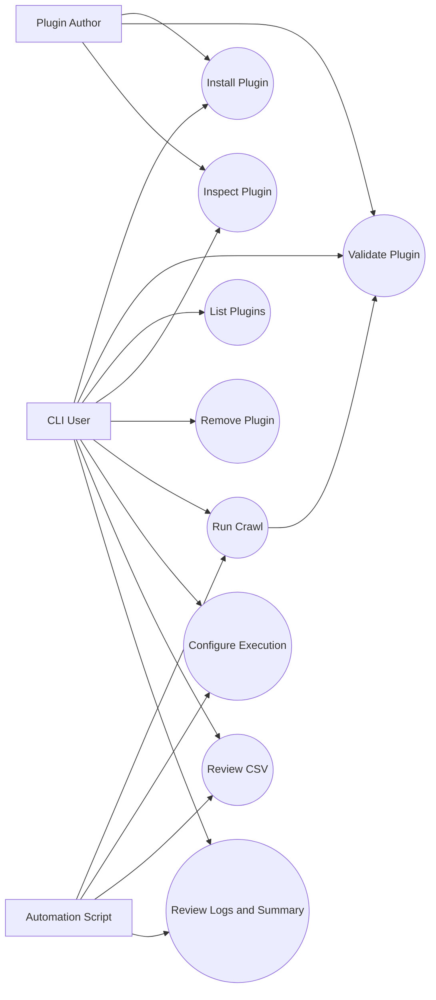
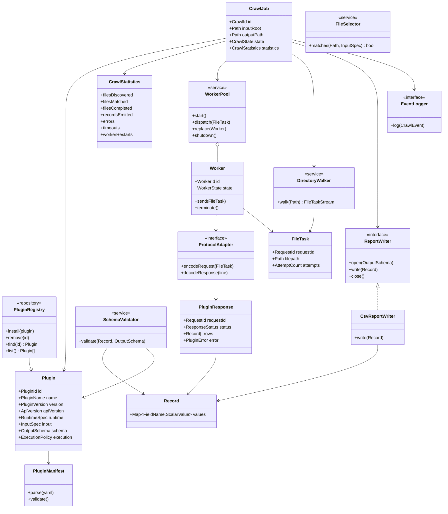
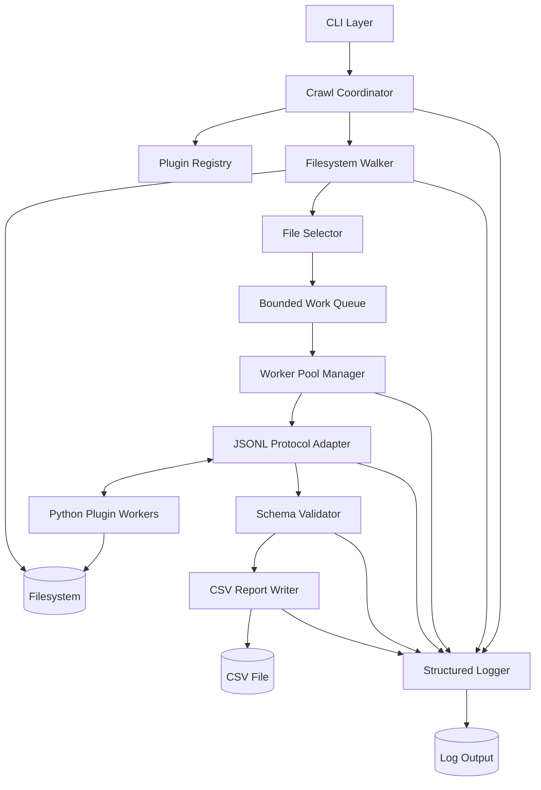
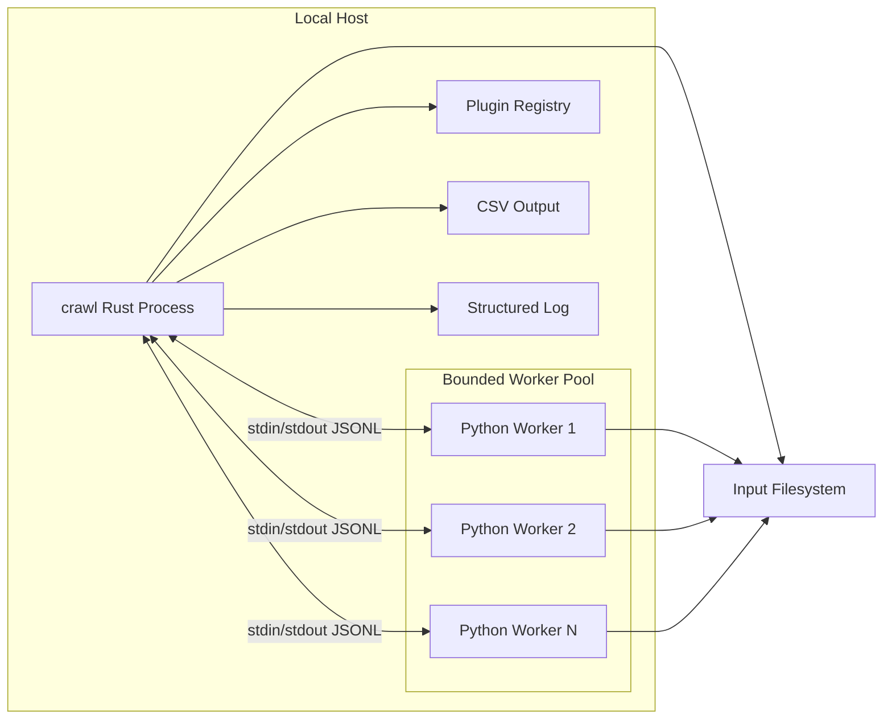
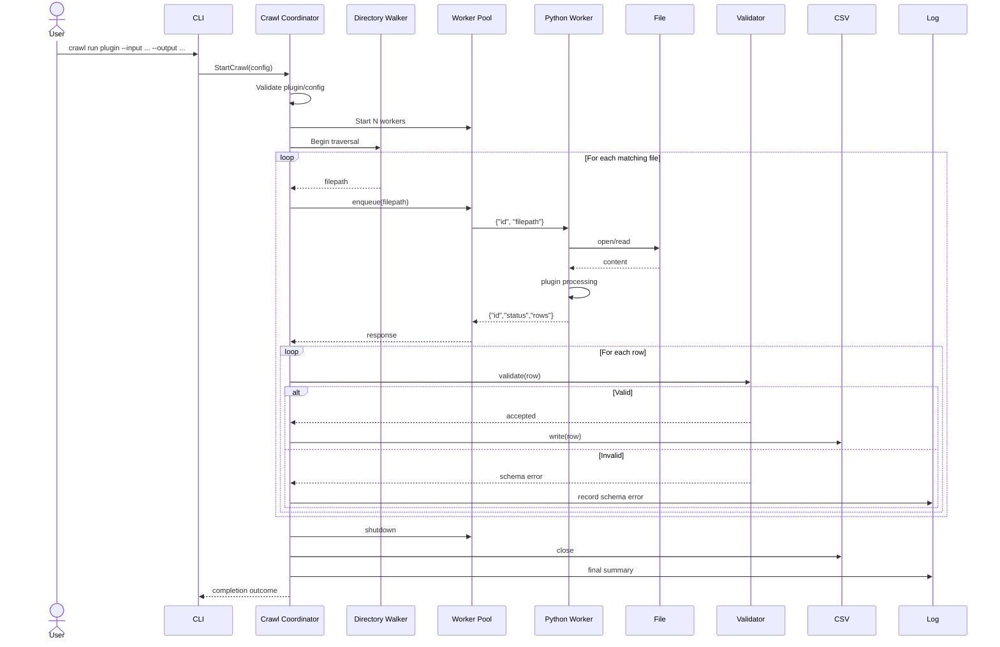
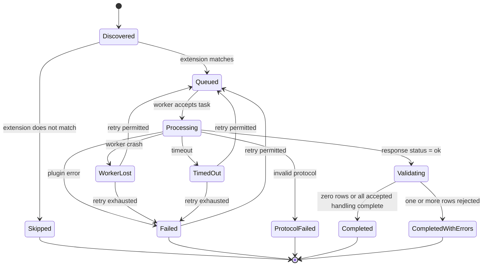
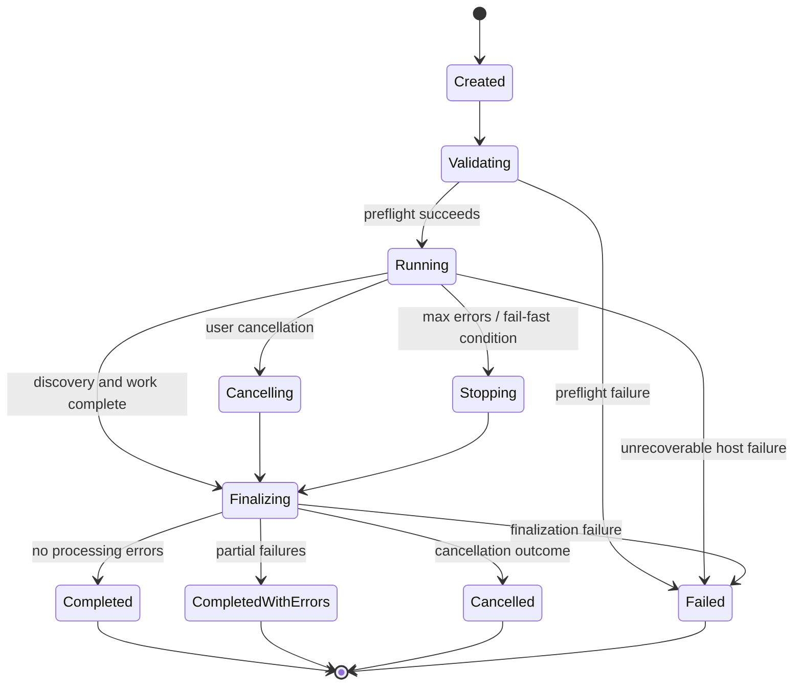
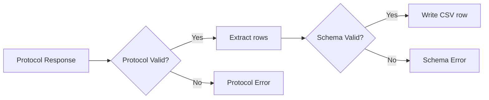
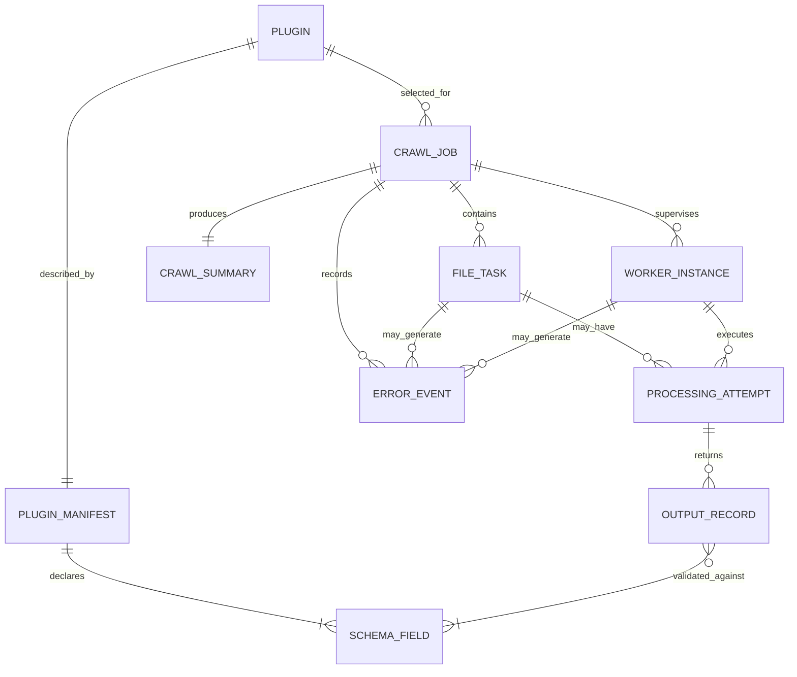

# Software Requirements Specification: Modular High-Throughput File Processing Crawler

**System name:** `crawl`
**Document type:** Software Requirements Specification
**Target architecture:** Rust host with isolated Python plugin workers
**Specification style:** IEEE 830-inspired
**Status:** Draft derived from the supplied problem analysis 

---

# 1. Introduction

## 1.1 Purpose

This document specifies the requirements for `crawl`, a reusable local file-processing runtime.

The system recursively discovers files, selects files applicable to a processing plugin, schedules processing with bounded concurrency, executes Python plugins in isolated subprocess workers, validates structured plugin output, writes valid output records to CSV, records failures, and produces an execution summary.

The system separates two responsibilities:

* The **host** determines which files to process, when to process them, how to supervise processing, and how to report results.
* A **plugin** determines what domain-specific information to extract from one file.

The first implementation targets local execution with one selected plugin per crawl.

## 1.2 Scope

`crawl` consists of:

* a Rust command-line application;
* a plugin registry;
* versioned plugin manifests;
* recursive filesystem discovery;
* extension-based file selection;
* bounded work queues;
* persistent Python worker processes;
* a JSON Lines request/response protocol;
* worker supervision and timeout handling;
* output-schema validation;
* streaming CSV generation;
* structured operational logging; and
* crawl summary generation.

The first release does not require:

* distributed processing;
* untrusted-code sandboxing;
* arbitrary nested report structures;
* multiple plugin runtimes;
* multi-plugin execution in one crawl;
* resumable crawls;
* JSONL, SQLite, or Parquet report output.

These capabilities may be added later if validated by usage requirements.

## 1.3 Goals

The system shall:

1. eliminate repeated implementation of directory crawling and processing infrastructure;
2. keep file-specific processing logic outside the Rust host;
3. process very large directory trees without loading all file paths or report rows into memory;
4. isolate plugin crashes and dependency failures from the host;
5. support parallel processing without depending on Python thread-level parallelism;
6. produce deterministic CSV schemas;
7. detect plugin contract violations;
8. prevent one bad file or plugin invocation from terminating an otherwise valid crawl by default; and
9. provide enough operational information to diagnose partial failures.

## 1.4 Definitions

| Term            | Definition                                                                                                                     |
| --------------- | ------------------------------------------------------------------------------------------------------------------------------ |
| Crawl           | One execution that traverses an input directory and processes matching files with a selected plugin.                           |
| Host            | The Rust `crawl` executable and its core runtime.                                                                              |
| Plugin          | Independently installable processing logic that accepts a file path and returns zero or more records.                          |
| Plugin manifest | Declarative metadata describing a plugin, including version, runtime, input extensions, output schema, and execution controls. |
| Worker          | A persistent subprocess hosting one installed plugin.                                                                          |
| Worker pool     | A bounded set of reusable plugin worker processes.                                                                             |
| Record          | One flat structured output object produced by a plugin for an input file.                                                      |
| Schema          | Ordered definition of permitted report fields, field types, and nullability or required status.                                |
| JSONL           | Newline-delimited JSON used as the initial host-worker protocol.                                                               |
| File task       | A request to process one discovered file.                                                                                      |
| Partial success | A crawl that completes despite one or more file-level processing failures.                                                     |
| Protocol error  | A worker response that cannot be interpreted according to the supported host-plugin protocol.                                  |
| Schema error    | A syntactically valid plugin result that violates the declared plugin output schema.                                           |

## 1.5 Requirement Keywords

* **Shall** indicates a mandatory requirement.
* **Should** indicates a recommended behavior that may be deferred or changed.
* **May** indicates an optional capability.

---

# 2. Overall Description

## 2.1 Product Perspective

`crawl` is a plugin-hosting file-processing runtime rather than a domain-specific crawler.

Its conceptual processing model is:

```text
File → Plugin → Records
```

At crawl scale:

```text
Directory
    ↓
Streaming discovery
    ↓
File filtering
    ↓
Bounded queue
    ↓
Parallel plugin execution
    ↓
Schema validation
    ↓
Record flattening
    ↓
Streaming CSV output
```

## 2.2 Primary Actors

### CLI User

A user who:

* installs or removes plugins;
* validates plugin installations;
* inspects registered plugins;
* starts crawls;
* selects input and output locations;
* configures operational controls; and
* inspects results and logs.

### Plugin Author

A developer who:

* implements file-specific processing;
* defines the plugin manifest;
* declares supported file extensions;
* declares an output schema;
* packages Python dependencies; and
* tests compatibility with the host.

### Operator or Automation Script

A human or automated process that:

* invokes `crawl`;
* evaluates exit codes;
* consumes generated CSV;
* archives or analyzes structured logs; and
* monitors successful and partial-success execution.

## 2.3 Use Case Model

The following diagram identifies the principal externally visible operations and actors.



**Purpose and coverage:** This use case model covers plugin lifecycle management, crawl execution, configuration, and consumption of outputs. It intentionally excludes plugin-internal file-analysis behavior because that behavior is plugin-specific.

## 2.4 Operating Environment

The first implementation assumes:

* a local filesystem or a filesystem mounted locally;
* a Rust-compatible desktop or server operating environment;
* a configured Python runtime for Python plugins;
* sufficient permission to traverse the requested input tree;
* sufficient permission to start subprocesses;
* sufficient permission and disk capacity to write output and logs.

The system may encounter:

* SSD storage;
* spinning disks;
* network-mounted filesystems;
* CPU-intensive plugins;
* I/O-intensive plugins;
* very large directory trees.

## 2.5 Product Constraints

### REQ-001 — Local Execution

The first release shall execute on one local host and shall not require a distributed scheduler.

### REQ-002 — Rust Host

The first implementation shall implement crawl orchestration in Rust.

### REQ-003 — Python Plugin Runtime

The first implementation shall support Python as the plugin execution runtime.

### REQ-004 — Process Isolation

The host shall execute Python plugin logic outside the Rust host process.

### REQ-005 — Persistent Worker Model

The default plugin execution model shall reuse persistent Python workers for multiple file tasks rather than starting one Python interpreter per file.

### REQ-006 — Host-Owned Output

Only the Rust host shall write the final CSV report.

### REQ-007 — Trusted Plugin Assumption

The first release shall treat installed plugins as trusted executable code.

The subprocess boundary shall provide fault isolation but shall not be represented as a security sandbox.

## 2.6 Assumptions

The requirements rely on the following stated assumptions:

* A crawl may encounter hundreds of thousands or millions of files.
* A plugin may fail, hang, crash, return malformed protocol messages, or reject individual files.
* A plugin output schema is available before crawl execution.
* One input file may produce zero, one, or many records.
* Flat records are sufficient for the initial CSV contract.
* Bounded concurrency is preferable to unrestricted concurrency.
* Python ecosystem compatibility is valuable enough to justify a Rust/Python process boundary.
* Completion-order output is acceptable as the likely default unless deterministic ordering is later required.

---

# 3. System Features

## 3.1 Plugin Registration and Discovery

### REQ-010 — Install Plugin

The CLI shall provide a command equivalent to:

```bash
crawl plugin install <plugin-source>
```

### REQ-011 — Register Valid Plugin

When installation succeeds, the host shall create or update a registry entry that permits subsequent selection of the plugin by its registered name.

### REQ-012 — Reject Invalid Manifest

The host shall reject installation when the plugin manifest cannot be parsed or violates the supported manifest contract.

### REQ-013 — Reject Unsupported API Version

The host shall reject a plugin whose declared `api_version` is unsupported.

### REQ-014 — Validate Runtime

Plugin validation shall confirm that the declared Python runtime can be started.

### REQ-015 — Validate Entrypoint

Plugin validation shall confirm that the declared Python entry point can be loaded according to the plugin runtime contract.

### REQ-016 — Validate Callable

When the manifest names a processing function or equivalent callable, plugin validation shall confirm that it exists and is callable.

### REQ-017 — Validate Schema Before Registration

The host shall validate the output schema before completing plugin registration.

### REQ-018 — Validate Extensions

Every declared file extension shall be syntactically valid according to the manifest contract.

### REQ-019 — Validate Optional Self-Test

If a plugin provides a supported self-test mechanism, `crawl plugin validate` shall execute it and report its result.

The exact self-test mechanism remains an open contract decision.

### REQ-020 — List Plugins

The CLI shall provide:

```bash
crawl plugin list
```

The command shall display registered plugin identities and versions.

### REQ-021 — Inspect Plugin

The CLI shall provide:

```bash
crawl plugin inspect <plugin>
```

The command shall expose the registered plugin manifest or an equivalent normalized representation.

### REQ-022 — Remove Plugin

The CLI shall provide:

```bash
crawl plugin remove <plugin>
```

The command shall remove the plugin's registry association.

The first release need not delete external Python environments unless plugin packaging defines ownership of those environments.

---

## 3.2 Crawl Initialization

### REQ-030 — Run Command

The CLI shall support an invocation equivalent to:

```bash
crawl run <plugin> \
  --input <directory> \
  --output <report.csv> \
  --log <crawl.log>
```

### REQ-031 — Plugin Resolution

Before traversing the input directory, the host shall resolve the requested plugin from the registry.

### REQ-032 — Preflight Validation

Before scheduling files, the host shall verify at minimum:

* the plugin manifest is readable;
* the plugin API version is supported;
* the input location can be accessed;
* output configuration is valid;
* the output schema can be converted into a CSV column layout; and
* required worker runtime information is available.

### REQ-033 — Fail Before Processing on Configuration Error

If preflight validation fails, the host shall terminate the crawl without processing input files.

### REQ-034 — Overwrite Protection

The host shall prevent accidental overwrite of an existing report unless the user explicitly authorizes overwrite.

The exact CLI flag name is implementation-defined.

### REQ-035 — Record Execution Metadata

At crawl start, the host shall record enough metadata to identify:

* selected plugin;
* plugin version;
* input path;
* output destination;
* effective worker count;
* timeout setting; and
* crawl start time.

---

## 3.3 Filesystem Traversal

### REQ-040 — Recursive Discovery

The host shall recursively traverse the configured input directory.

### REQ-041 — Streaming Discovery

The host shall emit discovered file tasks incrementally and shall not require the complete directory listing to be retained in memory.

### REQ-042 — Extension Filtering

The host shall compare discovered files against the selected plugin's effective extension configuration before enqueueing processing tasks.

### REQ-043 — Skip Nonmatching Files

A discovered file that does not match the effective extension configuration shall not be sent to a plugin worker.

### REQ-044 — Symlink Policy

The crawler shall apply an explicit symlink traversal policy.

The default should be `follow_symlinks = false`, as represented in the supplied design.

### REQ-045 — Traversal Failure Isolation

A filesystem error affecting one file or directory entry shall be recorded without automatically terminating the entire crawl unless continued traversal is impossible or fail-fast behavior applies.

### REQ-046 — Discovery Metrics

The host shall count at least:

* filesystem entries examined;
* files discovered;
* files matched for processing; and
* discovery errors.

---

## 3.4 Work Scheduling and Backpressure

### REQ-050 — Bounded Work Queue

The host shall place matched file paths into a bounded work queue.

### REQ-051 — Backpressure

If the work queue reaches capacity, file discovery shall block or otherwise reduce production rather than allowing unbounded memory growth.

### REQ-052 — Configurable Worker Count

The user shall be able to configure the number of active plugin workers.

### REQ-053 — Automatic Worker Count

The runtime shall support an automatic worker-count mode.

The algorithm used to determine the automatic count is not specified by the source and shall be treated as an implementation policy subject to benchmarking.

### REQ-054 — Configurable Queue Capacity

The runtime shall support a bounded queue capacity determined either by configuration or an implementation-defined default.

### REQ-055 — No Unbounded Concurrency

The host shall not create an unbounded number of plugin subprocesses or in-flight file tasks.

---

## 3.5 Python Worker Pool

### REQ-060 — Worker Startup

The host shall start a bounded pool of plugin worker subprocesses before or during file processing.

### REQ-061 — Worker Reuse

A healthy worker shall be eligible to process multiple sequential file tasks.

### REQ-062 — One Active Request per Worker

Unless a future protocol version explicitly adds worker-side concurrency, each worker shall process no more than one host request at a time.

### REQ-063 — Request Identifier

Every host-to-worker processing request shall contain an identifier that allows the host to correlate the worker response with the submitted task.

### REQ-064 — Request File Path

Every processing request shall include the target file path.

### REQ-065 — Worker Standard Output

Worker `stdout` shall be reserved for protocol messages.

### REQ-066 — Worker Standard Error

The host shall capture worker `stderr` separately from the request/response protocol.

### REQ-067 — Worker Crash Detection

The host shall detect unexpected worker process termination.

### REQ-068 — Worker Restart

After an unexpected worker termination, the host shall be able to start a replacement worker while the crawl remains active.

### REQ-069 — Affected Task Failure

If a worker terminates while processing a file, the host shall mark the affected task as failed unless retry policy causes the task to be retried successfully.

### REQ-070 — Worker Timeout

The host shall enforce a per-file processing timeout when a timeout is configured.

### REQ-071 — Timeout Recovery

When a worker exceeds the per-file timeout, the host shall:

1. record a timeout error for the task;
2. stop or otherwise invalidate the hung worker;
3. create a replacement worker if further work remains; and
4. continue the crawl unless termination policy requires otherwise.

### REQ-072 — Retry Policy

The runtime shall support a bounded retry count for failed file tasks when configured by the plugin or effective execution configuration.

### REQ-073 — No Infinite Retry

The host shall never retry a file indefinitely.

---

## 3.6 Plugin Request/Response Protocol

### REQ-080 — JSONL Framing

The initial Python worker protocol shall use one complete JSON object per line.

### REQ-081 — Request Contract

A file-processing request shall be semantically equivalent to:

```json
{
  "id": 42,
  "filepath": "/data/a.txt"
}
```

### REQ-082 — Successful Response Contract

A successful processing response shall identify the request and contain zero or more records, for example:

```json
{
  "id": 42,
  "status": "ok",
  "rows": [
    {
      "filename": "/data/a.txt",
      "line": 7,
      "entity": "Example"
    }
  ]
}
```

### REQ-083 — Zero-Row Success

A worker shall be permitted to return an empty `rows` array for a successfully processed file.

### REQ-084 — Multiple-Row Success

A worker shall be permitted to return more than one record for a single file.

### REQ-085 — Worker Error Response

The protocol shall define a structured response for plugin-declared file-processing failures.

The exact error object fields remain to be finalized.

### REQ-086 — Malformed Protocol Handling

If a worker emits malformed JSON on protocol `stdout`, the host shall classify the event as a protocol failure.

### REQ-087 — Unexpected Message Handling

If a syntactically valid message violates the current protocol contract, the host shall reject it as a protocol failure.

### REQ-088 — Protocol Versioning

Compatibility between the plugin and host shall be governed by a declared API or protocol version.

---

## 3.7 Schema Validation

### REQ-090 — Declared Schema

Every executable plugin shall declare its output record schema before processing begins.

### REQ-091 — Initial Primitive Types

The initial schema system shall support at least:

* `string`;
* `integer`;
* `number`; and
* `boolean`.

### REQ-092 — Optional Datetime Type

The initial implementation may support a `datetime` type if its lexical representation and CSV serialization are explicitly defined.

### REQ-093 — Flat Records

The first release shall restrict report records to flat field/value mappings.

### REQ-094 — Nested Data

Nested objects and arbitrary arrays shall not be directly represented as native CSV structures in the first release.

A plugin may represent complex data as a schema-approved serialized string if permitted by its contract.

### REQ-095 — Field Validation

For every returned record, the host shall validate:

* field names;
* field presence;
* type compatibility; and
* nullability or required status.

### REQ-096 — Reject Invalid Record

A record that violates the declared schema shall not be written as a valid output row.

### REQ-097 — Record Schema Error

The host shall create a structured error record or log event describing each rejected output record.

### REQ-098 — Schema Field Order

The host shall derive CSV column order from the declared plugin schema rather than from arbitrary dictionary iteration or arrival order.

### REQ-099 — Continuous Validation

Schema validation shall occur during result processing, before each record is handed to the CSV writer.

---

## 3.8 CSV Reporting

### REQ-100 — CSV Output

The first release shall generate one CSV report per crawl invocation.

### REQ-101 — Streaming CSV Writer

The host shall write validated rows incrementally and shall not require all plugin output to be retained in memory.

### REQ-102 — Single Writer

One host-owned output component shall serialize access to the CSV destination.

### REQ-103 — Stable Column Set

For a crawl, the CSV column set shall remain constant after processing begins.

### REQ-104 — Zero-Result Crawl

A crawl in which no plugin records are emitted shall still complete with a valid result artifact or documented empty-result behavior.

### REQ-105 — Completion-Order Capability

The implementation shall support writing records in processing completion order.

### REQ-106 — Deterministic Ordering

Deterministic report row ordering is not required for the initial release unless explicitly enabled by a future or optional configuration.

### REQ-107 — No Plugin File Writes to Shared Report

The plugin API shall not require or permit plugins to coordinate direct writes to the host's final CSV as part of the normal result contract.

---

## 3.9 Logging and Observability

### REQ-110 — Structured Operational Logging

The host shall support structured execution logs.

JSON is the preferred internal structured representation.

### REQ-111 — Human-Readable Logging

The host may additionally support a human-readable log presentation.

### REQ-112 — Crawl Lifecycle Events

The host shall log crawl start and crawl completion.

### REQ-113 — Plugin Identity in Logs

The crawl log shall identify the plugin name and plugin version.

### REQ-114 — Error Logging

The host shall log at least:

* filesystem failures;
* plugin-declared processing failures;
* timeouts;
* worker crashes;
* worker restarts;
* protocol violations; and
* output schema violations.

### REQ-115 — Worker Diagnostic Capture

Captured worker `stderr` shall be available for diagnostics without being parsed as a normal protocol response.

### REQ-116 — Duration Metrics

The host shall record total crawl duration.

### REQ-117 — Processing Metrics

The final summary shall report, at minimum:

* files discovered;
* files matched;
* files completed;
* records emitted;
* total errors;
* timeouts; and
* worker restarts.

### REQ-118 — Error Categories

The summary shall distinguish error categories sufficiently to prevent large crawls from hiding operationally important failure classes behind one aggregate error count.

---

## 3.10 Failure Policy

### REQ-120 — File-Level Failure Isolation

A failure to process one file shall not terminate the crawl by default.

### REQ-121 — Worker-Level Failure Isolation

A worker failure shall not terminate the Rust host process.

### REQ-122 — Fail-Fast Configuration

The runtime shall support a fail-fast execution mode.

### REQ-123 — Maximum Errors

The runtime shall support an optional maximum-error threshold.

### REQ-124 — Maximum Error Termination

When a configured maximum-error threshold is reached, the host shall stop scheduling new file tasks and perform an orderly shutdown.

### REQ-125 — Graceful Cancellation

The host shall support graceful cancellation of an active crawl.

### REQ-126 — Cancellation Scheduling

After cancellation is accepted, the host shall not enqueue additional file tasks.

### REQ-127 — Cancellation Cleanup

Cancellation shall trigger orderly cleanup of workers and output resources to the extent allowed by the operating system.

---

## 3.11 Exit Status

### REQ-130 — Machine-Readable Outcome

The process exit status shall distinguish materially different completion outcomes.

### REQ-131 — Configuration Failure Status

Configuration or preflight failure shall have an exit status distinguishable from a successfully started crawl.

### REQ-132 — Successful Crawl Status

A crawl that completes without processing errors shall have a success exit status.

### REQ-133 — Partial Error Status

The system shall provide a distinguishable outcome for a completed crawl containing file-level or plugin-level errors.

### REQ-134 — Fatal Runtime Status

An unrecoverable crawl-engine failure shall have an exit status distinct from ordinary file-level processing errors.

The exact numeric exit-code mapping remains an implementation decision.

---

# 4. External Interface Requirements

## 4.1 Command-Line Interface

The system is CLI-first and does not require a graphical user interface.

The initial command surface shall include:

```text
crawl run <plugin>
crawl plugin install <source>
crawl plugin validate <plugin>
crawl plugin list
crawl plugin inspect <plugin>
crawl plugin remove <plugin>
```

### REQ-140 — CLI Parse Errors

Invalid CLI syntax shall produce a non-success exit status and a human-readable error.

### REQ-141 — Help

Each top-level command and relevant subcommand shall provide discoverable help text.

### REQ-142 — Run Inputs

`crawl run` shall accept:

* a registered plugin identifier;
* an input directory;
* an output CSV location; and
* log configuration.

### REQ-143 — Operational Options

The run interface shall support configuration for relevant operational controls, including:

* worker count;
* timeout;
* fail-fast behavior;
* maximum errors;
* verbosity; and
* overwrite authorization.

Queue-size configuration should also be supported.

## 4.2 Plugin Manifest Interface

A plugin shall be described by a machine-readable YAML manifest.

A representative contract is:

```yaml
api_version: "1"

plugin:
  name: entity-lines
  version: "1.0.0"
  description: Extract entities and source line numbers

runtime:
  type: python
  command:
    - python
    - -m
    - entity_lines.worker

input:
  extensions:
    - ".txt"
    - ".md"
  follow_symlinks: false

output:
  format: records
  schema:
    filename:
      type: string
      required: true
    line:
      type: integer
      required: true
    entity:
      type: string
      required: true

execution:
  workers: auto
  timeout_seconds: 30
  max_retries: 1
```

### REQ-150 — Manifest API Version

The manifest shall declare `api_version`.

### REQ-151 — Plugin Identity

The manifest shall declare a plugin name and version.

### REQ-152 — Runtime Declaration

The manifest shall declare sufficient information for the host to start the worker runtime.

### REQ-153 — Input Extension Declaration

The manifest shall declare its default supported file extensions.

### REQ-154 — Output Format

The initial manifest contract shall support record-oriented output.

### REQ-155 — Schema Definition

The manifest shall define each output field's name and type.

### REQ-156 — Required or Nullable Semantics

The schema shall declare whether each field is mandatory or nullable using one consistent manifest convention.

### REQ-157 — Execution Controls

The manifest may define defaults for:

* worker count;
* per-file timeout; and
* retry count.

### REQ-158 — Effective Configuration

Where both the plugin manifest and CLI can define the same execution option, the system shall use a documented precedence rule.

The exact precedence hierarchy remains to be specified.

## 4.3 Host-to-Worker Interface

Transport:

```text
Host stdin stream → Worker
Worker stdout stream → Host
Worker stderr stream → Diagnostic log path
```

Framing:

```text
one JSON object + newline
```

### REQ-160 — UTF-8 Protocol

Protocol JSON shall be encoded as UTF-8.

### REQ-161 — Complete-Line Message Boundary

The host shall treat one newline-terminated JSON object as one protocol message.

### REQ-162 — Path Preservation

The protocol shall preserve the file path sufficiently for the worker to open the file represented by the host task.

### REQ-163 — Response Correlation

The host shall verify that each response identifier corresponds to an outstanding request sent to the responding worker.

## 4.4 Filesystem Interface

### REQ-170 — Read-Only Source Behavior

The crawler shall not require modification of source files to perform normal processing.

### REQ-171 — File Race Handling

The crawler shall tolerate the possibility that a file is deleted, replaced, or changed between discovery and plugin access by reporting the resulting processing or filesystem failure.

### REQ-172 — Best-Effort Filesystem Semantics

The initial release shall not guarantee a filesystem snapshot across the duration of a crawl.

## 4.5 Output Interface

The principal output interface is CSV.

### REQ-180 — CSV Header

The output shall contain columns corresponding to the declared schema.

### REQ-181 — CSV Escaping

The CSV writer shall correctly escape field values according to the selected CSV serialization rules.

### REQ-182 — Schema-Compatible Serialization

Each accepted value shall be converted to a CSV representation consistent with its declared type.

### REQ-183 — Atomicity Policy

The system shall document whether partial CSV content is retained or removed after cancellation or fatal failure.

The source does not establish this policy.

## 4.6 Logging Interface

### REQ-190 — Log Destination

The user shall be able to specify a log destination or otherwise use the implementation's documented default logging destination.

### REQ-191 — Protocol Separation

Worker diagnostic messages shall not be allowed to corrupt host-worker protocol parsing.

---

# 5. Nonfunctional Requirements

## 5.1 Performance

### NFR-001 — Streaming Memory Model

Memory consumption attributable to discovery and report aggregation shall be bounded with respect to the total number of files and total number of emitted report rows.

### NFR-002 — No Full Directory Materialization

The host shall not require storage of every discovered file path before processing begins.

### NFR-003 — No Full Report Materialization

The host shall not require storage of all valid output rows before CSV writing begins.

### NFR-004 — Worker Startup Amortization

The default architecture shall amortize Python interpreter startup across multiple files by reusing workers.

### NFR-005 — Concurrent Pipeline

Filesystem discovery, plugin processing, validation, and report writing should operate as a concurrent producer/consumer pipeline where dependencies permit.

### NFR-006 — Benchmark-Based Defaults

Default worker-concurrency policy should be selected or revised using representative benchmarks rather than assuming that the maximum available parallelism produces the best throughput.

Representative benchmarks should include:

* SSD;
* spinning disk;
* network-mounted input;
* CPU-heavy plugins; and
* I/O-heavy plugins.

## 5.2 Reliability

### NFR-010 — Failure Containment

A crash inside Python processing code shall not cause memory corruption or process failure in the Rust host.

### NFR-011 — Recoverable Worker Failure

The host shall recover from an individual worker crash when replacement workers can be started.

### NFR-012 — Timeout Enforcement

A nonresponsive plugin invocation shall not be permitted to block the crawl indefinitely when a finite timeout is configured.

### NFR-013 — Output Integrity

Only schema-valid records shall enter the normal CSV report.

### NFR-014 — Bounded Resource Use

Worker pool size and work queue depth shall be bounded.

## 5.3 Scalability

### NFR-020 — Large Directory Suitability

The design shall remain operational when the number of discovered files is sufficiently large that retaining the complete crawl in memory would be impractical.

### NFR-021 — File Count Independence

Core scheduler memory requirements shall depend primarily on configured queue sizes and active worker state, not directly on total crawl file count.

## 5.4 Maintainability

### NFR-030 — Separation of Concerns

Filesystem traversal, worker supervision, protocol handling, schema validation, reporting, plugin registry operations, and plugin-specific processing shall be separable implementation concerns.

### NFR-031 — Stable Plugin Boundary

Plugin authors shall not need knowledge of Rust crawl-engine internals to implement a conforming plugin.

### NFR-032 — Versioned Contract

Changes that can break plugin compatibility shall be governed through an explicit API or protocol version.

### NFR-033 — Extensible Runtime Boundary

The host-worker protocol should remain sufficiently language-neutral that a later runtime could implement the same protocol without redesigning the crawl engine.

Support for non-Python runtimes is not a first-release requirement.

## 5.5 Security

### NFR-040 — Trusted-Code Documentation

Documentation shall state that installed plugins execute as trusted local code.

### NFR-041 — No Sandbox Claim

Documentation shall not describe subprocess isolation as protection against malicious plugin behavior.

### NFR-042 — Minimal Host Exposure

The protocol should expose only information required for processing, rather than providing plugins with internal host objects or memory.

## 5.6 Usability

### NFR-050 — Actionable Errors

Configuration errors shall identify the invalid configuration element when practical.

### NFR-051 — File-Level Diagnostics

A processing error shall be attributable to the affected file when the host knows the file identity.

### NFR-052 — Plugin-Level Diagnostics

Errors resulting from worker startup or plugin loading shall identify the affected plugin.

### NFR-053 — Automation Compatibility

Commands shall provide stable process exit statuses suitable for shell scripts and other automation.

## 5.7 Portability

### NFR-060 — Path Abstraction

The implementation shall use operating-system-appropriate path handling and shall not assume POSIX path syntax internally where Rust's path abstractions are available.

### NFR-061 — Python Interpreter Configuration

The design shall permit the selected plugin to use an explicit Python interpreter or equivalent runtime command.

---

# 6. Domain Model

## 6.1 Object Model

The following diagram describes major entities, value objects, services, repositories, and interfaces.



**Purpose and coverage:** This class diagram establishes object-oriented responsibility boundaries. It distinguishes persisted plugin registration from runtime crawl state and separates interfaces from concrete implementations.

## 6.2 Entities

### Plugin

Identity-bearing registered processing module.

**Identity:** plugin name plus version or another registry-defined stable identifier.

**Invariants:**

* has a supported API version;
* has a valid runtime specification;
* has at least one valid output schema;
* has a valid plugin identity.

### CrawlJob

Represents one execution of `crawl run`.

**Invariants:**

* references one selected plugin in the first release;
* has one input root;
* has one primary CSV output;
* occupies exactly one defined crawl state at a time.

### FileTask

Represents processing of one file.

**Invariants:**

* has a unique request identifier within its active protocol scope;
* has one file path;
* has a bounded retry/attempt count.

### Worker

Represents one managed plugin subprocess.

**Invariants:**

* belongs to one worker pool;
* runs the selected plugin;
* has no more than one active file request unless a future protocol changes the invariant.

## 6.3 Value Objects

Expected value objects include:

* `PluginName`;
* `PluginVersion`;
* `ApiVersion`;
* `PluginId`;
* `CrawlId`;
* `WorkerId`;
* `RequestId`;
* `InputSpec`;
* `RuntimeSpec`;
* `ExecutionPolicy`;
* `OutputSchema`;
* `SchemaField`;
* `Timeout`;
* `RetryLimit`;
* `WorkerCount`;
* `QueueCapacity`;
* `ScalarValue`; and
* `ErrorCategory`.

Value objects shall validate their own representation at construction boundaries where practical.

## 6.4 Services

### PluginValidationService

Responsibilities:

* validate manifest shape;
* check API compatibility;
* check schema validity;
* verify runtime availability;
* verify plugin entry point;
* optionally execute a plugin self-test.

### CrawlCoordinator

Responsibilities:

* conduct preflight validation;
* initialize components;
* coordinate discovery and scheduling;
* supervise lifecycle transitions;
* coordinate graceful shutdown;
* compute final outcome.

### DirectoryWalker

Responsibilities:

* recursively discover input files;
* apply filesystem traversal rules;
* surface traversal errors;
* provide streaming discovery.

### FileSelector

Responsibilities:

* determine whether a discovered file is eligible for the selected plugin.

### WorkerPool

Responsibilities:

* create workers;
* assign tasks;
* enforce worker count;
* detect unavailable workers;
* replace failed workers;
* stop workers.

### SchemaValidator

Responsibilities:

* validate field presence;
* validate type compatibility;
* validate required/null constraints;
* return either a validated record or a schema violation.

### ReportService

Responsibilities:

* normalize field order;
* serialize valid records;
* coordinate final report lifecycle.

## 6.5 Repositories

### PluginRegistry

The plugin registry shall abstract persistence of registered plugin metadata.

The source does not prescribe registry storage technology.

Possible implementations include local files or a local metadata database, but selecting one is outside this SRS.

## 6.6 Commands

Domain or application commands include:

```text
InstallPlugin
ValidatePlugin
ListPlugins
InspectPlugin
RemovePlugin
StartCrawl
CancelCrawl
ProcessFile
RestartWorker
WriteRecord
```

## 6.7 Events

Operational/domain events should include:

```text
CrawlStarted
CrawlCompleted
CrawlCancelled
FileDiscovered
FileMatched
FileProcessingStarted
FileProcessingCompleted
FileProcessingFailed
RecordAccepted
RecordRejected
WorkerStarted
WorkerCrashed
WorkerTimedOut
WorkerRestarted
ProtocolViolationDetected
TraversalErrorDetected
```

Events need not form a public event-sourcing API.

They define useful observability and testing boundaries.

---

# 7. Architecture and Design Constraints

## 7.1 Component Architecture



**Purpose and coverage:** This component diagram defines stable architectural boundaries. The worker process cannot write directly to the report; worker output must pass through the protocol and validation components.

## 7.2 Deployment Model



**Purpose and coverage:** The deployment view emphasizes process isolation. Rust and Python execute in different processes on the same local host. Workers receive file paths and access those files directly.

## 7.3 Layer Boundaries

### CLI → Application Layer

**Input:** parsed user intent and options.

**Contract:** invalid syntax shall be rejected before crawl orchestration.

### Application Layer → Plugin Registry

**Input:** plugin identifier.

**Postcondition:** either one validated registered plugin is returned or plugin resolution fails.

### Application Layer → Directory Walker

**Input:** input root and traversal policy.

**Output:** streaming file discoveries and traversal errors.

### Scheduler → Worker Pool

**Input:** valid file task.

**Precondition:** task matches selected plugin input policy.

**Postcondition:** task is either dispatched, cancelled, or rejected because the crawl is terminating.

### Host → Plugin Worker

**Input:** JSONL request containing request ID and path.

**Output:** one protocol-conforming response or a detectable worker/protocol failure.

### Protocol Layer → Schema Validator

**Precondition:** response syntax and message-level protocol are valid.

**Output:** zero or more candidate records.

### Schema Validator → Report Writer

**Precondition:** record conforms to the selected plugin schema.

**Postcondition:** accepted record is queued or written exactly once, subject to the report writer's failure semantics.

## 7.4 Processing Sequence



**Purpose and coverage:** This sequence describes the successful request lifecycle and the validation boundary. Error paths are defined separately in worker and crawl state models.

## 7.5 File Task State Model



**Purpose and coverage:** This diagram defines file-level failure isolation and bounded retry behavior. The exact question of whether protocol failures are retryable is left to the finalized retry policy.

## 7.6 Crawl State Model



**Purpose and coverage:** The crawl state model separates configuration failure, normal success, partial success, cancellation, and unrecoverable failure so that exit status and reporting can reflect the actual outcome.

## 7.7 Architectural Constraints

### ARC-001

The host shall own orchestration logic and shall not depend on plugin-specific file semantics.

### ARC-002

Plugins shall not receive Rust host objects or host memory references.

### ARC-003

The first runtime boundary shall be process-based.

### ARC-004

The host-plugin protocol shall be explicitly versioned.

### ARC-005

CSV shall be treated as an output renderer, not as the plugin's direct programming interface.

### ARC-006

Concurrency shall use bounded workers and bounded queues.

### ARC-007

The architecture shall permit processing, validation, and output writing to occur incrementally.

### ARC-008

Only validated data shall cross the validation-to-report contract boundary.

### ARC-009

The design should use established libraries for standard infrastructure where practical, including categories represented in the source such as:

* CLI parsing;
* serialization;
* CSV output;
* structured tracing; and
* filesystem traversal.

Specific library choice is an implementation decision.

---

# 8. Data and Validation Contracts

## 8.1 Plugin Manifest Model

A normalized conceptual model is:

```text
PluginManifest
├── api_version: string
├── plugin
│   ├── name: string
│   ├── version: string
│   └── description?: string
├── runtime
│   ├── type: "python"
│   └── command: string[]
├── input
│   ├── extensions: string[]
│   └── follow_symlinks?: boolean
├── output
│   ├── format: "records"
│   └── schema: map<string, SchemaField>
└── execution
    ├── workers?: integer | "auto"
    ├── timeout_seconds?: number
    └── max_retries?: integer
```

### VAL-001 — Manifest Parse

A plugin manifest shall be rejected if it is not valid YAML.

### VAL-002 — Manifest API Version

`api_version` shall be a supported version identifier.

### VAL-003 — Plugin Name

The plugin name shall be nonempty and valid for registry lookup.

Exact allowed characters remain to be specified.

### VAL-004 — Plugin Version

The plugin version shall be nonempty.

Whether semantic-version syntax is mandatory remains open.

### VAL-005 — Runtime Type

The first release shall accept `python` as the supported runtime type.

### VAL-006 — Runtime Command

The runtime definition shall contain sufficient command information to launch a worker.

### VAL-007 — Extensions

`input.extensions` shall contain one or more valid extensions when extension-based matching is required.

### VAL-008 — Worker Count

An explicit worker count shall be an integer greater than zero.

### VAL-009 — Timeout

An explicit timeout shall be greater than zero.

### VAL-010 — Retry Count

`max_retries` shall be an integer greater than or equal to zero.

## 8.2 Schema Field Model

```text
SchemaField
├── name: string
├── type: string | integer | number | boolean | [datetime]
└── required/nullability: boolean policy
```

### VAL-020 — Unique Field Names

A schema shall not contain duplicate field names.

### VAL-021 — Supported Field Type

Every schema field shall use a type supported by the active manifest API version.

### VAL-022 — Required Fields

A record shall contain every field declared required by the schema.

### VAL-023 — Unexpected Fields

The host shall use an explicit policy for fields returned by a plugin but not declared by the schema.

The source does not establish whether extra fields shall be rejected or ignored. Rejecting them is the safer deterministic-contract option but remains an open decision.

### VAL-024 — Null Values

A null value shall be rejected for a field whose schema does not permit null.

### VAL-025 — Integer Type

A value declared as `integer` shall not be accepted if it can only be represented as a non-integral number or string without an explicitly defined coercion rule.

### VAL-026 — No Implicit Unsafe Coercion

The host shall not silently perform lossy type coercion.

## 8.3 Request Contract

Conceptual request schema:

```json
{
  "id": 42,
  "filepath": "/data/a.txt"
}
```

### VAL-030 — Request ID

`id` shall uniquely identify an outstanding request within the relevant worker or crawl correlation scope.

### VAL-031 — File Path

`filepath` shall be a nonempty path supplied by the host.

### PRE-001 — Request Dispatch Precondition

Before sending a request, the host shall have:

* selected the plugin;
* determined that the file matches effective input rules;
* allocated an eligible worker; and
* created an outstanding task record.

### POST-001 — Request Completion Postcondition

After terminal handling of a request, the host shall no longer treat its request identifier as actively awaiting an ordinary response.

## 8.4 Success Response Contract

```json
{
  "id": 42,
  "status": "ok",
  "rows": []
}
```

### VAL-040 — Response ID

The response `id` shall match an outstanding request.

### VAL-041 — Success Status

A successful response shall declare the protocol-defined success status.

### VAL-042 — Rows Collection

A successful response shall provide a collection of zero or more records.

### VAL-043 — Row Object

Each item in `rows` shall be a record object compatible with schema validation.

## 8.5 Error Response Contract

A plugin error response requires a final standardized shape.

At minimum, it should be capable of representing:

```text
request id
status = error
error category/code
human-readable message
optional plugin-specific diagnostic detail
```

### VAL-050 — Error Correlation

A plugin-declared error shall identify the request to which it applies.

### VAL-051 — Error Is Not a Valid Row

Plugin error information shall not be written into ordinary schema-defined CSV fields unless a future report contract explicitly chooses that model.

## 8.6 Report Data Flow



**Purpose and coverage:** This diagram shows two distinct validation boundaries. A message must first satisfy the worker protocol. Individual records must then satisfy the plugin schema.

## 8.7 Error Taxonomy

The system shall distinguish at least the following error domains:

| Error category       | Example                                    |
| -------------------- | ------------------------------------------ |
| Configuration        | Missing plugin, invalid CLI option         |
| Manifest             | Unsupported API version, malformed schema  |
| Runtime startup      | Python interpreter unavailable             |
| Plugin load          | Module or callable cannot be loaded        |
| Filesystem discovery | Permission denied while traversing         |
| File access          | Plugin cannot open discovered file         |
| Plugin processing    | Parser throws a plugin-reported exception  |
| Timeout              | File-processing deadline exceeded          |
| Worker crash         | Worker process exits unexpectedly          |
| Protocol             | Malformed JSON or invalid protocol message |
| Schema               | Returned row violates declared schema      |
| Report output        | CSV destination cannot be written          |
| Cancellation         | Crawl interrupted by user request          |
| Host fatal           | Internal unrecoverable runtime failure     |

### VAL-060 — Error Attribution

Where the information is known, an error event shall identify:

* crawl;
* plugin;
* affected file;
* worker;
* request; and
* error category.

Fields not relevant or not known may be absent.

## 8.8 Data Relationship Model



**Purpose and coverage:** The ER model captures logical relationships among registered plugins, crawls, processing attempts, output records, and errors. It does not require these runtime concepts to be stored in a relational database.

---

# 9. Acceptance Criteria

The following acceptance criteria are intended to become automated integration, system, or contract tests.

## AC-001 — Valid Plugin Installation

**Given** a plugin package with a supported API version, valid Python runtime, loadable entry point, and valid output schema,
**When** the user runs `crawl plugin install`,
**Then** the command succeeds and the plugin is available through `crawl plugin list`.

Covers: REQ-010 through REQ-018.

## AC-002 — Unsupported Plugin Version

**Given** a plugin manifest declaring an unsupported `api_version`,
**When** installation or validation is attempted,
**Then** the host rejects the plugin before a crawl can use it.

Covers: REQ-013, VAL-002.

## AC-003 — Plugin Inspection

**Given** a registered plugin,
**When** the user runs `crawl plugin inspect <plugin>`,
**Then** the system displays its effective registered metadata, including version, input extensions, schema, and runtime configuration.

Covers: REQ-021.

## AC-004 — Recursive Selection

**Given** an input tree containing matching and nonmatching extensions across multiple directory levels,
**When** the crawl runs,
**Then** only matching files are submitted to plugin workers.

Covers: REQ-040 through REQ-043.

## AC-005 — Streaming Discovery

**Given** a directory containing a very large number of files,
**When** traversal begins,
**Then** worker processing can begin before traversal discovers the final file.

Covers: REQ-041, NFR-002.

## AC-006 — Backpressure

**Given** workers that process files more slowly than filesystem discovery,
**And** a configured bounded queue,
**When** the queue reaches capacity,
**Then** the number of queued tasks does not exceed the configured capacity.

Covers: REQ-050, REQ-051, NFR-014.

## AC-007 — Persistent Worker Reuse

**Given** one worker and multiple eligible input files,
**When** the crawl executes,
**Then** the same worker process can complete more than one file task without interpreter restart between every file.

Covers: REQ-005, REQ-061.

## AC-008 — Multiple Workers

**Given** a configured worker count of `N`,
**When** enough eligible files exist,
**Then** the host runs no more than `N` active plugin workers.

Covers: REQ-052, REQ-055.

## AC-009 — Zero Output Rows

**Given** a plugin that successfully processes a file and returns:

```json
{"id":1,"status":"ok","rows":[]}
```

**When** the response is handled,
**Then** the file is treated as successfully processed and no CSV data row is written for that response.

Covers: REQ-083.

## AC-010 — Multiple Output Rows

**Given** one file whose plugin response contains three schema-valid records,
**When** the response is validated,
**Then** all three records are written to the report.

Covers: REQ-084.

## AC-011 — Stable CSV Columns

**Given** a plugin schema whose fields are declared in a known schema order,
**When** records arrive with object fields in different serialization orders,
**Then** all CSV rows use the schema-derived column ordering.

Covers: REQ-098, REQ-103.

## AC-012 — Invalid Row Rejection

**Given** a plugin response containing a row with an invalid required-field type,
**When** schema validation runs,
**Then** that row is not written as a valid CSV row and a schema error is logged.

Covers: REQ-095 through REQ-099.

## AC-013 — Worker Crash Isolation

**Given** multiple files are queued,
**And** one worker crashes while processing a file,
**When** other work remains,
**Then**:

* the Rust host remains running;
* the affected task receives the configured failure/retry treatment;
* a worker replacement is started when needed; and
* processing of unrelated files can continue.

Covers: REQ-067 through REQ-069, NFR-010, NFR-011.

## AC-014 — Plugin Timeout

**Given** a per-file timeout of 30 seconds,
**And** a plugin invocation fails to respond within the configured timeout,
**When** the deadline is exceeded,
**Then** the host records a timeout, invalidates the hung worker, and continues according to retry and crawl-failure policies.

Covers: REQ-070, REQ-071.

## AC-015 — Malformed JSON

**Given** a worker writes non-JSON text to protocol `stdout`,
**When** the host reads the line,
**Then** the host classifies it as a protocol error and does not interpret it as a report record.

Covers: REQ-065, REQ-086.

## AC-016 — `stderr` Isolation

**Given** a worker writes diagnostic text to `stderr`,
**When** processing completes normally,
**Then** the diagnostic content can be logged and does not invalidate an otherwise valid protocol response on `stdout`.

Covers: REQ-066, REQ-115.

## AC-017 — File Failure Does Not Stop Crawl

**Given** 100 eligible files,
**And** one file produces an ordinary plugin-processing failure,
**When** fail-fast is disabled and no maximum-error threshold is reached,
**Then** the host continues processing the remaining eligible files.

Covers: REQ-120.

## AC-018 — Fail-Fast

**Given** fail-fast mode is enabled,
**When** a failure satisfying the fail-fast policy occurs,
**Then** the system stops normal scheduling and proceeds to orderly termination.

Covers: REQ-122.

## AC-019 — Maximum Error Threshold

**Given** a maximum-error threshold of `10`,
**When** the tenth qualifying error is recorded,
**Then** the host stops scheduling new work and enters controlled shutdown.

Covers: REQ-123, REQ-124.

## AC-020 — Graceful Cancellation

**Given** a crawl is running,
**When** the user requests cancellation,
**Then** new file scheduling stops, workers are shut down according to the cancellation policy, output resources are finalized where possible, and the crawl reports a cancellation outcome.

Covers: REQ-125 through REQ-127.

## AC-021 — No Full Report Buffer

**Given** a plugin emits a large number of records,
**When** the crawl runs,
**Then** previously validated records can be persisted before all input files complete and the host does not require every report row to coexist in memory.

Covers: REQ-101, NFR-003.

## AC-022 — No Concurrent CSV Corruption

**Given** multiple Python workers complete tasks concurrently,
**When** their valid rows are produced,
**Then** all final CSV writes pass through the host-owned report writer and result in a structurally valid CSV.

Covers: REQ-102, REQ-107.

## AC-023 — Existing Output Protection

**Given** the requested output path already exists,
**And** overwrite has not been explicitly authorized,
**When** the crawl is invoked,
**Then** the host does not overwrite the existing file.

Covers: REQ-034.

## AC-024 — Summary Counts

**Given** a crawl containing successful tasks, failed tasks, emitted rows, a timeout, and a worker restart,
**When** finalization completes,
**Then** the summary reports counts for the required operational metrics.

Covers: REQ-117, REQ-118.

## AC-025 — Filesystem Race

**Given** a file is discovered and is removed before a worker opens it,
**When** the plugin attempts processing,
**Then** the resulting failure is attributable to that file and does not imply snapshot consistency.

Covers: REQ-171, REQ-172.

## AC-026 — Configuration Failure Before Work

**Given** an invalid plugin configuration,
**When** `crawl run` is invoked,
**Then** no file is submitted to plugin processing and the process exits with a configuration-failure outcome.

Covers: REQ-032, REQ-033, REQ-131.

## AC-027 — Partial Success Outcome

**Given** a crawl reaches the end of discovery and processing,
**And** at least one file failed but the crawl was not fatally terminated,
**When** finalization completes,
**Then** the outcome is distinguishable from both complete success and fatal host failure.

Covers: REQ-133.

## AC-028 — Flat Schema Enforcement

**Given** an initial-version schema or record containing an unsupported native nested object,
**When** the manifest or row is validated,
**Then** it is rejected unless represented through an explicitly permitted serialized string field.

Covers: REQ-093, REQ-094.

---

# 10. Open Questions

The source analysis deliberately leaves the following requirements unresolved. They shall remain open rather than being silently assumed.

## OQ-001 — One Plugin or Multiple Plugins per Crawl

Should one invocation always run exactly one plugin, or should a future crawl run several compatible plugins against each discovered file?

**Current assumption:** one plugin per invocation.

## OQ-002 — Host-Generated Metadata Columns

Should the host automatically inject fields such as:

* source path;
* plugin name;
* processing duration;
* processing status; or
* error information?

The alternative is to keep the primary CSV restricted to plugin-defined fields.

## OQ-003 — Duplicate Records

Are duplicate rows valid plugin output, or should the host provide optional deduplication?

**Current assumption:** no deduplication requirement has been established.

## OQ-004 — Deterministic Ordering

Does reproducible output ordering matter enough to require a deterministic mode?

**Current assumption:** completion-order output is appropriate for the performance-oriented default.

## OQ-005 — Plugin Dependency Isolation

Must every plugin use a dedicated virtual environment or explicit interpreter, or may several plugins share one Python environment?

## OQ-006 — Security Boundary

Will plugins always be trusted local code?

If untrusted third-party plugins become a requirement, operating-system-level sandboxing and a materially stronger threat model will be required.

## OQ-007 — Extension Override

May a project-level or CLI configuration override the extensions declared in the plugin manifest?

If yes, the configuration-precedence contract must define the effective extension list.

## OQ-008 — Future Output Formats

Should the host architecture explicitly commit now to future renderers such as:

* JSONL;
* SQLite; or
* Parquet?

The current architecture can preserve this possibility by keeping plugin records independent of CSV serialization.

## OQ-009 — Batch Processing

Should a future protocol allow a plugin worker to receive multiple file paths in one request for workloads that benefit from batching?

**Current assumption:** one file per request.

## OQ-010 — Resumable Crawls

Are checkpoints and resume-after-interruption required for the first release or a later operational enhancement?

**Current assumption:** later enhancement.

## OQ-011 — Error Response Schema

What exact fields are mandatory for plugin-declared error responses?

The final contract should define, at minimum, request correlation, an error category or code, and a human-readable message.

## OQ-012 — Extra Record Fields

What shall happen when a plugin returns a field that is not declared by its output schema?

Possible policies are:

* reject the record;
* ignore the field; or
* permit it under an explicit extensible-schema mode.

A strict rejection policy best preserves deterministic contracts but is not explicitly required by the source.

## OQ-013 — Schema Versioning

Is the plugin `api_version` sufficient to version output-schema semantics, or should the schema language have an independent version?

## OQ-014 — Semantic Versioning

Must plugin versions conform to Semantic Versioning, or is an opaque nonempty version string sufficient?

## OQ-015 — Configuration Precedence

When the same setting appears in the plugin manifest and CLI, what is the exact precedence?

A likely model is:

```text
CLI override > plugin manifest > host default
```

but this remains to be formally approved.

## OQ-016 — Retry Eligibility

Which failure classes are retryable?

A final policy is needed for at least:

* plugin-reported errors;
* worker crashes;
* timeouts;
* protocol violations;
* file access failures; and
* schema errors.

## OQ-017 — Partial Output After Fatal Failure

If a fatal host or output failure occurs after rows have already been written, shall the partial CSV:

* remain at the requested path;
* be renamed as partial;
* be deleted; or
* be written to a temporary file and promoted only during successful finalization?

## OQ-018 — Automatic Worker Count

What algorithm shall `workers: auto` use?

The source requires benchmarking rather than assuming that CPU count alone is optimal.

## OQ-019 — Path Metadata Consistency

Should the host capture file metadata such as size and modification time at discovery and make it available to reporting or plugins?

This could help identify files that change during a crawl but is not currently required.

## OQ-020 — Error Threshold Semantics

Which errors count toward `maximum errors`?

The final definition should specify whether the threshold includes:

* traversal errors;
* plugin errors;
* individual schema-invalid rows;
* timeouts;
* protocol errors; and
* worker crashes.

## OQ-021 — CSV Empty-Result Behavior

For a crawl with zero emitted records, should the system produce:

* a header-only CSV;
* an empty file; or
* no report file?

A header-only CSV is consistent with a schema-driven renderer but has not been explicitly selected.

## OQ-022 — Datetime Type

Should `datetime` belong to the initial schema type system?

If included, the SRS must define its canonical input representation and CSV serialization.

## OQ-023 — Plugin Self-Test Protocol

How shall a plugin expose an optional registration-time self-test?

The mechanism might be a dedicated worker command or manifest-declared test fixture, but the source does not select one.

## OQ-024 — Plugin Removal Ownership

Should `crawl plugin remove` delete plugin-managed virtual environments or package files, or only unregister the plugin?

This depends on the eventual plugin packaging model.

## OQ-025 — Final Exit-Code Mapping

The system requires distinguishable outcomes for:

* success;
* partial success;
* configuration failure;
* cancellation;
* plugin/runtime failure; and
* fatal host failure.

The exact numeric mapping remains to be defined.
