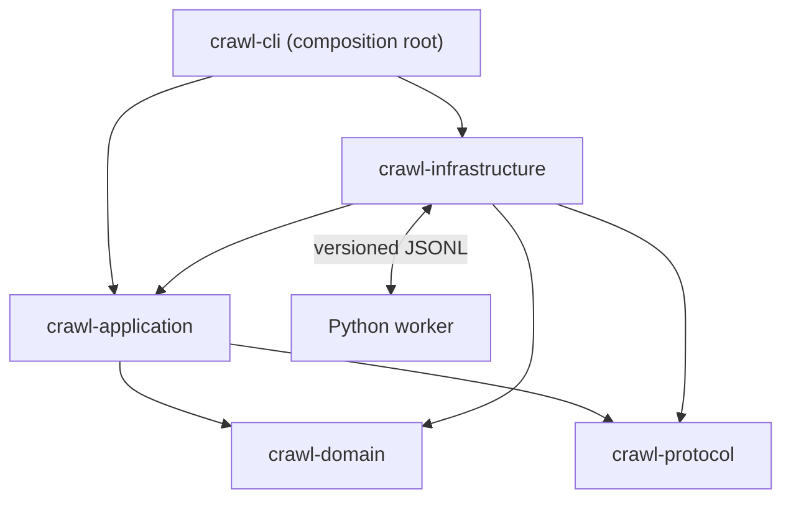

# Components and layering



The dependency rule points inward. `crawl-domain` knows nothing of the CLI,
Tokio, subprocesses, CSV, or the registry.

## Ports and adapters

| Port (application) | Adapter (infrastructure) |
|---|---|
| `PluginRegistry` | `FileRegistry` - one atomic JSON document |
| `DirectoryWalker` | `FilesystemWalker` - `ignore` walker on the blocking pool |
| `WorkerFactory` / `WorkerHandle` | `ProcessWorkerFactory` - Tokio child processes |
| `ReportWriter` | `CsvReportWriter` - temp-then-promote streaming CSV |
| `EventSink` | `TracingEventSink` - structured `tracing` events |

## Async boundary

Async is confined to channels, subprocess I/O, and traversal. Every decision -
manifest validation, schema rules, retry eligibility, threshold arithmetic,
state transitions, configuration precedence—is an ordinary synchronous
function, and therefore unit-testable without a runtime.

## Pipeline invariants

The coordinator holds four invariants structurally rather than by convention:

```text
active_workers          <= configured_workers   # one task per slot, never cloned
queued_tasks            <= queue_capacity       # bounded channel, single producer
active_request_per_worker <= 1                  # a slot owns its handle exclusively
attempts                <= 1 + max_retries      # retries happen in place
```

Retrying **in place**—inside the slot that already owns the task—rather
than re-queueing is deliberate: a retry that re-entered a full bounded queue
could deadlock against the workers meant to drain it.
