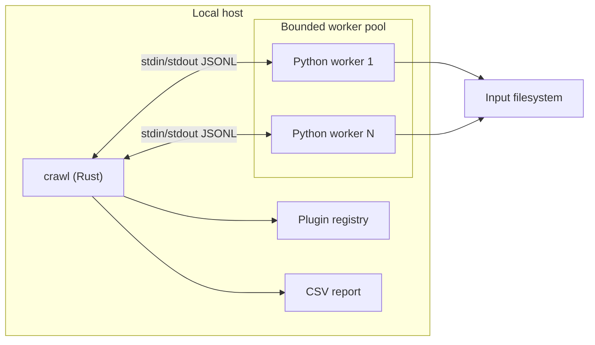

# Context

## Actors

| Actor | Uses `crawl` to |
|---|---|
| CLI user | Install, validate, inspect, and remove plugins; run crawls; read results |
| Plugin author | Implement per-file processing, declare a manifest and output schema |
| Automation | Invoke crawls, evaluate exit codes, consume CSV and structured logs |

## Deployment model

A local multiprocess application, not a service:

Workers receive file paths and open those files themselves. The host never
passes file contents or host objects across the boundary (ARC-002, NFR-042).

## Trust boundary

The process boundary is a **reliability** boundary. Documentation must never
describe it as protection against malicious plugin behaviour (NFR-040,
NFR-041).
