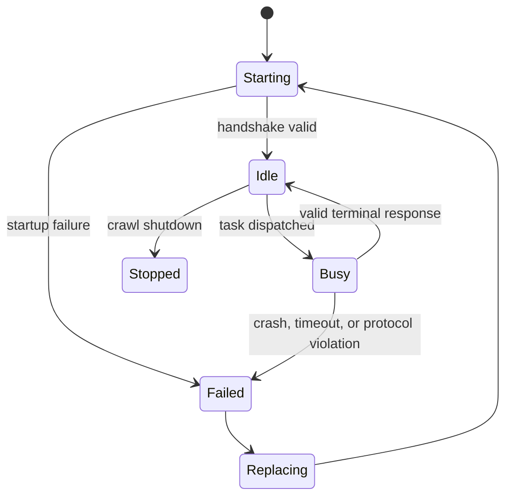
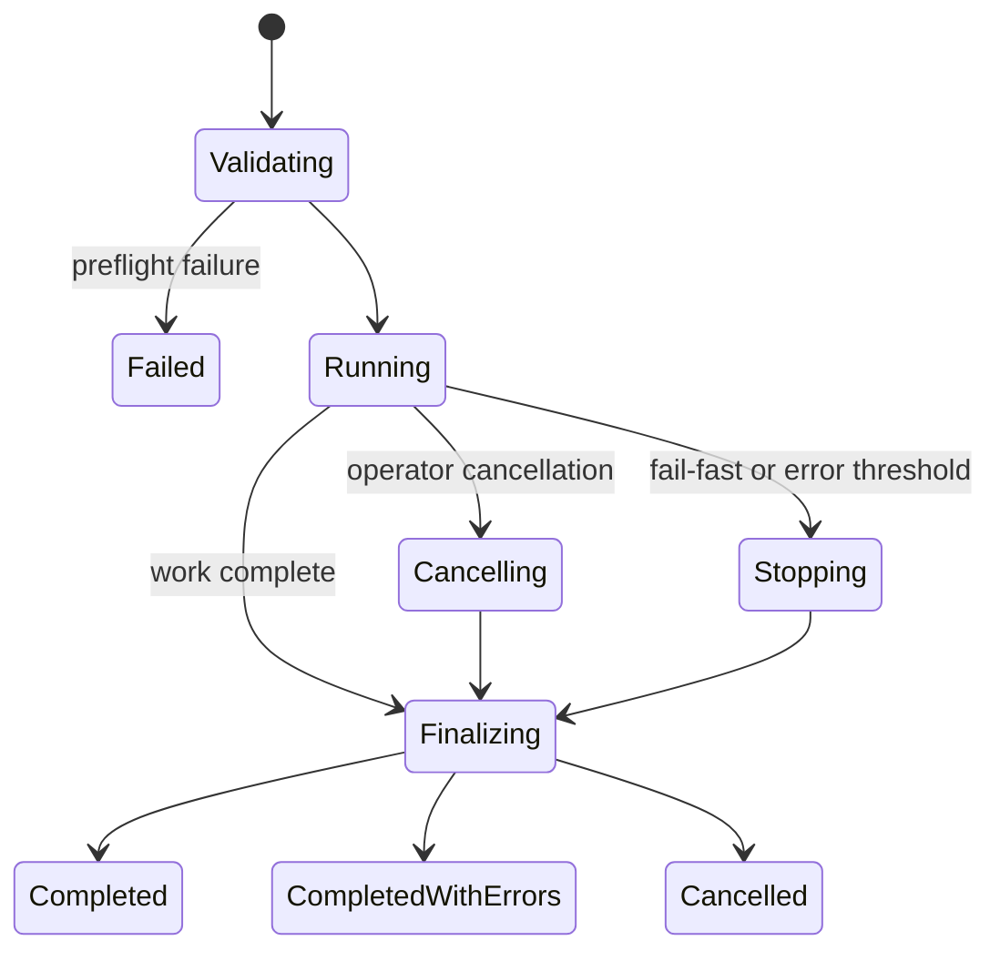

# Failure model

## Error taxonomy

Every observable failure maps to exactly one category, which drives four things
at once: the log event, retry eligibility, error-budget accounting, and the
exit code. Keeping that mapping in one enum is what stops the four from
drifting apart.

| Category | Retryable | Counts toward `--max-errors` |
|---|:--:|:--:|
| `configuration`, `manifest`, `registry`, `plugin_load` | no | no (fails preflight) |
| `runtime_startup` | no | yes |
| `traversal`, `file_access` | no | yes |
| `plugin_processing` | no | yes |
| `timeout` | **yes** | yes |
| `worker_crash` | **yes** | yes |
| `protocol` | **yes** | yes |
| `schema` | no | yes |
| `report` | no | yes |
| `cancellation`, `host_fatal` | no | no (determines the outcome directly) |

Two exclusions are worth stating plainly. Preflight categories cannot occur
once files are being scheduled, so they fail the crawl before it starts rather
than consuming its error budget. Cancellation and host-fatal failures already
determine the outcome on their own, so counting them would double-report.

Everything else counts, including rejected rows and report-write errors: a
crawl that failed to write its rows must never be reported as a success.

## Worker lifecycle

Every failure class invalidates the worker: a timeout leaves a hung
interpreter, a crash leaves no process, and a protocol violation leaves a
desynchronised stream. The slot's replacement increments its generation, so
`w2#3` reads as "slot 2, third process", making restart counting unambiguous.

## Crawl outcomes

Cancellation wins over error counts: a cancelled crawl reports cancellation,
not partial success, because the operator already knows why it stopped.

## What does *not* stop a crawl

A file that fails, a worker that crashes, a row that violates the schema, a
directory that cannot be traversed, or a plugin that writes to stderr. By
default the crawl continues and reports partial success. `--fail-fast` and
`--max-errors N` opt into stopping.
