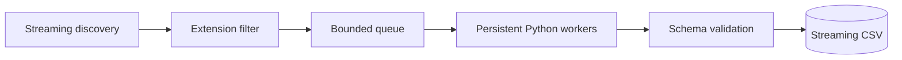

# Corpus Crawler

Corpus Crawler is a plugin-hosting file-processing runtime, not a domain-specific
crawler. Its conceptual model is one line long:

```text
File -> Plugin -> Records
```

At crawl scale that becomes a concurrent pipeline:



## What the host owns

Traversal, file selection, bounded concurrency, worker supervision, timeouts,
retries, protocol decoding, schema validation, CSV generation, structured
logging, and the crawl summary.

## What a plugin owns

Extracting information from **one file**. Nothing else. A plugin never sees
host internals, never coordinates writes to the report, and needs no knowledge
of the Rust engine.

## Trust boundary

Installed plugins are trusted local code. The subprocess boundary provides
**fault isolation**, not security isolation. A malicious plugin has whatever
access the invoking user has.

## Non-goals for v1

Distributed processing, sandboxing, nested report structures, multiple plugin
runtimes, multiple plugins per crawl, resumable crawls, and output formats
other than CSV.
